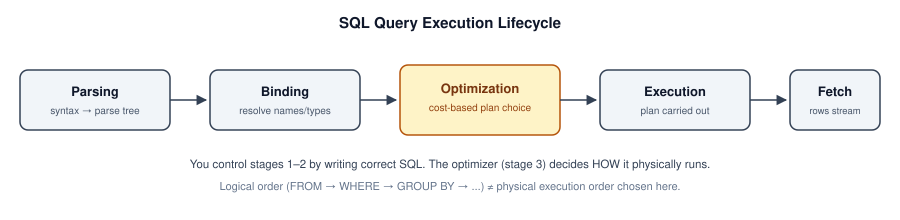
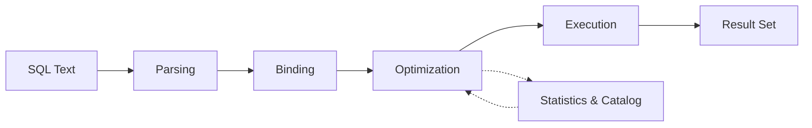

# Query Execution Lifecycle

> **Module 16 · Query Optimization**
> [Home](./README.md) · [Engineering Guide](./ENGINEERING_GUIDE.md) · [Cheatsheet](./CHEATSHEET.md) · [Troubleshooting](./TROUBLESHOOTING_GUIDE.md)
>
> **Lesson 01 of 07** · [Next: EXPLAIN →](./02_EXPLAIN_AND_EXECUTION_PLANS.md) · [SQL Lab](./01_QUERY_EXECUTION_LIFECYCLE.sql)

---

## Introduction

Before you can optimize a query, you need a mental model of what actually
happens to it after you hit "run." Most SQL users think of a query as a
single step: text in, rows out. In reality, a query passes through five
distinct stages, and almost every performance problem traces back to one
specific stage.

## Learning Objectives

- Name and order the five stages a query passes through
- Explain the difference between the **logical** processing order (what you
  learned as `FROM → WHERE → GROUP BY → ...`) and the **physical** execution
  order the optimizer actually chooses
- Identify which lifecycle stage is responsible for a given performance
  symptom

## Why This Exists

You cannot read an execution plan, reason about an index, or explain why a
rewritten query is faster if you don't know what stage of the lifecycle
you're influencing. "Add an index" changes stage 3. "Rewrite the subquery
as a JOIN" changes stage 2. Skipping this lesson means every later
optimization technique feels like a memorized trick instead of a logical
consequence.

## Business Motivation

Imagine a payments team query used inside a fraud-review dashboard:

```sql
SELECT e.emp_name, d.dept_name, COUNT(*) AS flagged_transactions
FROM employes e
JOIN departments d ON e.dept_id = d.dept_id
WHERE d.dept_name = 'Fraud Review'
GROUP BY e.emp_name, d.dept_name
ORDER BY flagged_transactions DESC;
```

At a startup with 200 employee rows, this runs instantly regardless of how
it's written. At a bank with 40 million transaction-linked rows behind a
similar query, the exact same SQL can take 30 seconds or 300 milliseconds
depending entirely on what happens during the five lifecycle stages below.

## The Five Stages



```text
┌───────────┐   ┌───────────┐   ┌────────────┐   ┌───────────┐   ┌─────────┐
│  Parsing  │ → │  Binding  │ → │Optimization│ → │ Execution │ → │  Fetch  │
└───────────┘   └───────────┘   └────────────┘   └───────────┘   └─────────┘
```

### Execution Flow



### 1. Parsing

The engine checks your SQL for syntactic correctness — matching keywords,
valid clause order, balanced parentheses. It has no idea yet whether
`departments` exists or whether `dept_name` is spelled correctly. This
stage produces a **parse tree**, a structural representation of your query.

### 2. Binding (semantic analysis)

The engine resolves every name in the parse tree against the actual schema:
does `employes` exist, does it have a `dept_id` column, is `d.dept_name` a
valid reference given the alias `d`. This is also where implicit type
conversions get decided — a common, invisible source of the non-SARGable
predicates covered in Lesson 03.

### 3. Optimization

This is the stage that matters most for this module. The **query
optimizer** takes the bound query and considers multiple possible
**execution plans** — different orders to access tables, different join
algorithms, different index choices — and picks the one it estimates will
be cheapest, using table statistics (row counts, value distributions) it
has cached about your data. This is called **cost-based optimization**: the
optimizer isn't finding the *correct* plan, it's finding the plan with the
lowest *estimated cost*, and it can be wrong if its statistics are stale.

### 4. Execution

The chosen plan is carried out: index lookups happen, tables are scanned,
joins are performed, sorts and aggregations run — all according to the plan
selected in stage 3, not according to the order you wrote the SQL clauses.

### 5. Fetch

Result rows are streamed back to the client. For large result sets, this
stage can itself become the bottleneck — a perfectly optimized query can
still feel slow if the client is fetching a million rows over a slow
network link.

## Logical Order vs. Physical Execution Order

You already know the **logical processing order** from earlier modules:

```text
FROM → JOIN → WHERE → GROUP BY → HAVING → SELECT → DISTINCT → ORDER BY → LIMIT
```

This defines what the *result must be equivalent to* — not what the engine
literally does step by step. During stage 3 (Optimization), the engine is
free to reorder joins, push a `WHERE` predicate down so it's applied before
a join instead of after, or compute `LIMIT` early to avoid processing rows
it will discard — as long as the final result matches what the logical
order would have produced.

This is the single most important idea in query optimization: **you write
logical order, the optimizer chooses physical order**, and almost every
optimization technique in this module is really a way of giving the
optimizer more freedom (or fewer excuses) to choose a cheap physical order.

## Engineering Notes

- Stateless query engines re-run all five stages every time. Many production
  databases cache the *parsed and bound* form of frequently-run queries
  (a **plan cache**) so stages 1–3 aren't repeated for identical queries —
  which is one reason parameterized queries (`WHERE emp_id = ?`) often
  outperform queries with literal values baked in on every call.
- The optimizer's decisions in stage 3 are only as good as its statistics.
  A table that grew from 10,000 to 10,000,000 rows without a statistics
  refresh can cause the optimizer to choose a plan that was correct for the
  old size and is badly wrong for the new one.

## MySQL / PostgreSQL / SQL Server Notes

- **PostgreSQL** exposes this most transparently via `EXPLAIN` and
  `EXPLAIN ANALYZE` (Lesson 02), and its optimizer statistics are visible in
  `pg_stats`.
- **MySQL** performs similar cost-based optimization but historically had a
  simpler optimizer than PostgreSQL or SQL Server for complex joins; recent
  versions (8.0+) have closed much of that gap.
- **SQL Server** caches execution plans aggressively and exposes them via
  the Query Store — useful for spotting when a plan *changed* for a query
  whose SQL didn't.

## Common Mistakes

- Assuming SQL executes top-to-bottom, left-to-right as written
- Believing that rewriting a query "in a smarter order" (e.g., manually
  filtering before joining) changes what the optimizer will do — it usually
  doesn't, because the optimizer already considers that reordering
- Blaming the network or application layer for slowness that's actually
  happening in stage 4 (Execution)

## Edge Cases

- **Plan cache poisoning**: a query first run with an atypical parameter value
  (e.g. a department with 1 employee) can get its plan cached and reused for
  every later call — including calls with very different, much larger
  parameter values — because the engine cached a plan optimized for the
  first case it saw.
- **Schema changes without a plan cache flush**: adding an index doesn't
  always invalidate cached plans for already-running connections in every
  engine/version — a session that's been open a long time may keep using
  a stale plan until it reconnects or the cache is explicitly cleared.

## Troubleshooting Guidance

- Query plan changed with no code change → check for a recent `ANALYZE` /
  statistics refresh, a data volume change, or a plan cache eviction.
- Query slow only for specific parameter values → suspect plan caching on a
  skewed/atypical first execution (see Edge Cases above).

## Scalability Considerations

At high query-per-second workloads, stages 1–3 (Parsing, Binding,
Optimization) become a real, measurable cost on their own — not just stage 4
(Execution). This is why connection poolers and prepared-statement reuse
matter operationally: skipping re-parsing and re-optimizing identical query
shapes on every call is a genuine throughput win at scale, independent of
any single query's execution cost.

## Additional Dialect Notes

- **Oracle**: uses a shared pool / library cache for parsed and optimized
  statements, with `CURSOR_SHARING` controlling how aggressively literal
  values are treated as reusable bind parameters.
- **SQLite**: has a comparatively simple, single-pass planner with no
  persistent cross-connection plan cache — appropriate for its embedded,
  single-process use case.
- **DuckDB**: uses a vectorized execution engine (operates on batches of
  rows, not one row at a time), which changes the cost profile of stages 3–4
  substantially versus traditional row-at-a-time engines — worth knowing if
  you work with it for local analytics.

## Summary

A query is not a single operation — it's a pipeline of five stages, and the
Optimization stage is where your SQL becomes a *plan*, chosen based on
statistics and cost, not on the order you happened to type the clauses.
Every later lesson in this module is about understanding and influencing
that one stage.

## Practice Challenges

1. Explain in your own words why a query can run fast one day and slow the
   next with no code changes.
2. For the fraud-review query above, name one WHERE-clause change that
   would force the optimizer to consider fewer possible plans.

## Real Company Usage

- **Stripe**: Plan cache behavior directly affects payment authorization latency — parameterized queries reuse parsed/optimized plans across millions of transactions per minute.
- **Cloudflare**: After bulk analytics imports, stale statistics in the Optimization stage cause 20× plan regressions until `ANALYZE` runs (see [Production Incident #5](./PRODUCTION_INCIDENTS.md)).
- **Shopify**: Black Friday write volume causes statistics drift within hours — auto-analyze thresholds tuned aggressively for order tables.

## Production Applications

- Diagnosing "query was fast yesterday" incidents → check stages 1–3 (plan cache, statistics)
- Explaining why parameterized queries outperform literal-heavy SQL → stage 1–3 caching
- Understanding why schema changes don't immediately fix slow queries → plan cache invalidation varies by engine

## Performance Notes

- Stages 1–3 cost is negligible for individual queries but significant at >1,000 QPS — connection poolers and prepared statements matter at scale.
- Stage 3 (Optimization) planning time itself can exceed execution time for queries joining 8+ tables.

## Optimization Notes

- When a query regresses with no code change, check stage 3 first: run `EXPLAIN` and compare the current plan to a saved baseline — plan cache invalidation and stale statistics both manifest here.
- Parameterized queries (`WHERE emp_id = $1`) reuse stages 1–3 across calls; literal-heavy SQL forces re-optimization every time. At high QPS, this alone can add measurable latency.
- After bulk `INSERT`/`UPDATE`/`DELETE`, schedule `ANALYZE` (PostgreSQL) or `UPDATE STATISTICS` (SQL Server) before the next reporting window — the optimizer's stage-3 decisions depend on fresh row counts and histograms.

## Interview Insight

Interviewers use lifecycle questions to test whether you debug systematically or guess. When asked "why did this query get slower?", walk through stages in order: code change (unlikely if none), statistics drift (stage 3), plan cache eviction (stages 1–3), or data growth (stage 4). Mentioning "logical vs. physical order" signals you understand that the optimizer reorders work — a strong differentiator from candidates who only know SQL syntax.

## Further Experiments

1. Run the same query twice with a literal (`WHERE emp_id = 42`) vs. a prepared statement and compare planning time in `EXPLAIN ANALYZE` — note the difference in stages 1–3.
2. Insert 100K rows into `employes`, skip `ANALYZE`, and compare `EXPLAIN` estimated rows before and after — observe how stage 3's cost model changes.
3. Save an execution plan today; repeat after a schema change (add/drop an index) and diff the plans to see which stage's output changed.

## Continue Learning

- Next: [Lesson 02 — EXPLAIN & Execution Plans](./02_EXPLAIN_AND_EXECUTION_PLANS.md)
- Reference: [ENGINEERING_GLOSSARY — Plan Cache, Statistics](./ENGINEERING_GLOSSARY.md)
- Practice: [PRACTICE_PROBLEMS.md — Problem 7](./PRACTICE_PROBLEMS.md)

## Related Modules

[`02_EXPLAIN_AND_EXECUTION_PLANS`](./02_EXPLAIN_AND_EXECUTION_PLANS.md) · [`03_SARGability`](./03_SARGABILITY_AND_INDEX_USAGE.md) · [`07_Query Tuning Workflow`](./07_QUERY_TUNING_WORKFLOW.md)

## Further Reading

- PostgreSQL documentation: "Planner/Optimizer" chapter
- Your database engine's documentation on plan caching / statement caching
- [ENGINEERING_GUIDE.md](./ENGINEERING_GUIDE.md) — module architecture overview
