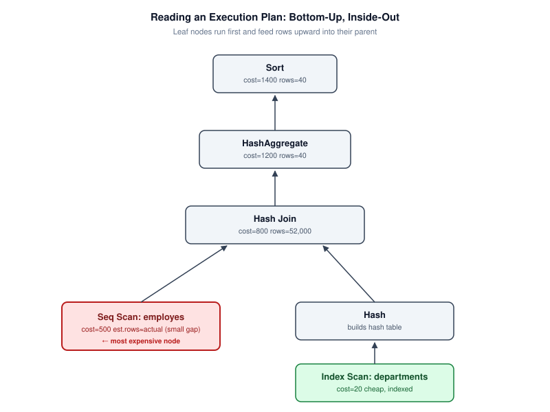
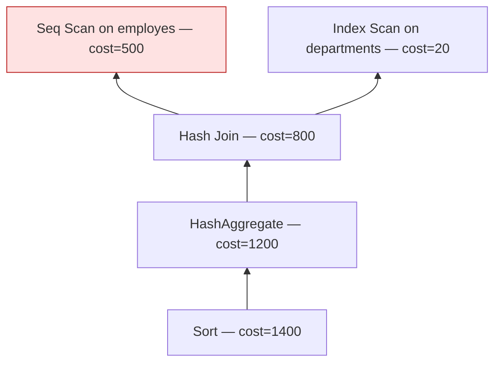

# EXPLAIN and Execution Plans

> **Module 16 · Query Optimization**
> [Home](./README.md) · [Engineering Guide](./ENGINEERING_GUIDE.md) · [Cheatsheet](./CHEATSHEET.md) · [Troubleshooting](./TROUBLESHOOTING_GUIDE.md)
>
> **Lesson 02 of 07** · [← Lifecycle](./01_QUERY_EXECUTION_LIFECYCLE.md) · [Next: SARGability →](./03_SARGABILITY_AND_INDEX_USAGE.md) · [SQL Lab](./02_EXPLAIN_AND_EXECUTION_PLANS.sql)

---

## Introduction

`EXPLAIN` is how you ask the query optimizer to show its work. It is the
single most important tool in this entire module — every other lesson
assumes you can run `EXPLAIN`, read its output, and identify the expensive
step.

## Learning Objectives

- Distinguish `EXPLAIN` (estimated plan) from `EXPLAIN ANALYZE` (actual,
  executed plan)
- Read a plan tree bottom-up and identify access methods (scan vs. index)
- Identify the gap between estimated and actual row counts, and explain why
  that gap matters
- Recognize the highest-cost node in a plan

## Why This Exists

Without `EXPLAIN`, query tuning is guesswork — changing things and hoping
they helped. With it, tuning becomes a measurement discipline: form a
hypothesis about what's slow, confirm it in the plan, make one change,
re-measure.

## Business Motivation

A retail analytics team runs this nightly to feed a dashboard:

```sql
SELECT d.dept_name, l.city, COUNT(*) AS staff_count
FROM employes e
JOIN departments d ON e.dept_id = d.dept_id
JOIN locations l ON d.location_id = l.location_id
WHERE l.country = 'India'
GROUP BY d.dept_name, l.city;
```

When this report's runtime jumps from 4 seconds to 90 seconds after a data
migration, `EXPLAIN ANALYZE` — not intuition — is how you find out whether
the cause is a missing index, stale statistics, or a changed join strategy.

## Estimated vs. Actual: EXPLAIN vs. EXPLAIN ANALYZE

- **`EXPLAIN`** shows the plan the optimizer *would* use and its *estimated*
  cost and row counts — based on statistics, without running the query.
- **`EXPLAIN ANALYZE`** actually executes the query and shows *actual*
  elapsed time and row counts alongside the estimates.

```sql
EXPLAIN
SELECT * FROM employes WHERE dept_id = 4;

EXPLAIN ANALYZE
SELECT * FROM employes WHERE dept_id = 4;
```

The gap between estimated and actual rows is one of the most useful signals
in query tuning: a large gap means the optimizer's statistics are stale or
its cardinality estimate for a filter/join is wrong — and it may be picking
a plan that made sense for the *estimated* data, not the *actual* data.

## Reading a Plan Tree



Plans are trees, read **bottom-up, inside-out**: the innermost/lowest nodes
run first and feed rows upward into their parent node.

### Visual Explanation



```text
Sort (cost=1400)
  └── HashAggregate (cost=1200)
        └── Hash Join (cost=800)
              ├── Seq Scan on employes (cost=500)   <- expensive
              └── Hash
                    └── Index Scan on departments (cost=20)
```

Here, the `Seq Scan on employes` is the most expensive leaf — that's your
starting hypothesis: `employes` is likely missing a useful index for this
query's filter or join column.

## Access Methods You'll See

| Node | Meaning |
|---|---|
| **Seq Scan / Table Scan** | Reads every row in the table — expensive on large tables |
| **Index Scan** | Uses an index to locate matching rows, then fetches them |
| **Index Only Scan** | Answers the query entirely from the index, no table lookup needed (see "covering index," Lesson 03) |
| **Bitmap Heap Scan** | Builds a bitmap of matching row locations from an index, then fetches — common for medium-selectivity filters |

## Engineering Notes

- Cost numbers are **unitless and relative**, not milliseconds — they're only
  meaningful for comparing plans against each other on the same engine.
- Always prefer `EXPLAIN ANALYZE` (or your engine's equivalent) over
  `EXPLAIN` alone when diagnosing an already-slow query — estimates can lie,
  actual execution can't.
- Running `EXPLAIN ANALYZE` on a write query (`UPDATE`/`DELETE`) actually
  executes it — use a transaction you roll back, or your engine's dry-run
  equivalent, when analyzing writes.

## MySQL / PostgreSQL / SQL Server Notes

- **PostgreSQL**: `EXPLAIN (ANALYZE, BUFFERS)` additionally reports actual
  disk/cache reads — essential for diagnosing I/O-bound queries.
- **MySQL**: `EXPLAIN ANALYZE` is available from 8.0.18+; earlier versions
  only support estimated `EXPLAIN`.
- **SQL Server**: use `SET STATISTICS IO, TIME ON` alongside the graphical
  or text execution plan for the closest equivalent to `EXPLAIN ANALYZE`.

## Common Mistakes

- Reading a plan top-down instead of bottom-up
- Trusting `EXPLAIN` estimates on a query that's already slow, instead of
  using `EXPLAIN ANALYZE` to see what actually happened
- Ignoring the estimated-vs-actual row gap, which is often the real story

## Interview Questions

- "What's the difference between EXPLAIN and EXPLAIN ANALYZE, and when would
  a large estimate-vs-actual gap mislead the optimizer?"
- "Given this plan, which node would you investigate first, and why?"

## Edge Cases

- `EXPLAIN` on a query with bind parameters may show a **generic plan**
  optimized for typical values, not the specific plan that will be chosen
  for the actual parameter value at call time — always prefer testing with
  representative real values.
- A query that looks cheap in `EXPLAIN ANALYZE` right after a benchmark run
  can be slow in production due to a **cold buffer cache** — the benchmark
  benefited from data already being in memory.

## Troubleshooting Guidance

- Plan "looks correct" but the query is still slow in production → check
  `BUFFERS`/IO stats (PostgreSQL: `EXPLAIN (ANALYZE, BUFFERS)`) to rule out
  disk I/O rather than assuming the plan shape itself is wrong.
- `EXPLAIN` output differs between staging and production for identical SQL
  → almost always a statistics or data-volume difference between
  environments, not a query problem.

## Scalability Considerations

Running `EXPLAIN ANALYZE` on write queries or very expensive reads in
production has real cost — it *executes* the query. At scale, prefer
running it against a production-like replica, or during low-traffic windows,
rather than directly against a live primary for anything beyond a quick,
cheap `SELECT`.

## Additional Dialect Notes

- **Oracle**: `EXPLAIN PLAN` combined with `DBMS_XPLAN.DISPLAY` gives the
  most detailed output; `DBMS_XPLAN.DISPLAY_CURSOR` shows the actual plan
  used for a statement that already ran.
- **SQLite**: `EXPLAIN QUERY PLAN` gives a simplified, high-level plan
  summary rather than a full cost-based breakdown, consistent with its
  simpler planner.
- **DuckDB**: `EXPLAIN ANALYZE` shows a pipeline-based breakdown reflecting
  its vectorized execution model, with per-operator timing.

## Summary

`EXPLAIN` and `EXPLAIN ANALYZE` turn "this query feels slow" into "this
specific node in this specific plan is expensive" — every optimization
technique in the rest of this module exists to fix a specific pattern you
learn to recognize here.

## Practice Challenges

1. Run `EXPLAIN ANALYZE` on any JOIN query from Module 03 against a
   sufficiently large copy of the schema and identify the most expensive
   node.
2. Find a query in your own work where estimated and actual row counts
   diverge by more than 10x, and explain a plausible cause.

## Real Company Usage

- **Uber**: Driver earnings dashboard outage diagnosed via SubPlan `loops=5000000` in EXPLAIN ANALYZE — correlated subquery in SELECT list ([Incident #3](./PRODUCTION_INCIDENTS.md)).
- **Netflix**: Recommendation feed regression identified by comparing estimated vs. actual row counts after schema migration.
- **GitHub**: Admin panel pagination degradation visible as growing `Sort` node cost in EXPLAIN at increasing OFFSET values.

## Production Applications

- First tool used in every query performance incident
- Required in PR review for any query touching tables > 100K rows
- Baseline measurement in the five-step tuning workflow ([Lesson 07](./07_QUERY_TUNING_WORKFLOW.md))

## Performance Notes

- `EXPLAIN ANALYZE` on write queries actually executes them — use transactions with ROLLBACK
- Cold buffer cache can make a well-planned query appear slow on first run — warm up before benchmarking
- Cost numbers are unitless and engine-specific — only compare plans on the same engine

## Optimization Notes

- Always start with `EXPLAIN ANALYZE`, not plain `EXPLAIN` — estimated costs lie when statistics are stale; actual timings reveal the truth.
- Find the **most expensive node** first (highest actual time or loops × per-loop cost). Optimizing a cheap node while an expensive `Seq Scan` or `Sort` dominates is wasted effort.
- When estimated rows diverge from actual rows by >10×, fix statistics before rewriting SQL — no rewrite helps if the optimizer is choosing plans based on wrong cardinality estimates.

## Interview Insight

"Walk me through this EXPLAIN output" is a staple senior-level question. Interviewers want you to: (1) identify the most expensive node, (2) explain what access method it uses and why, (3) propose one targeted fix. Saying "Seq Scan on 8M rows with a filter that could use an index" beats vague answers like "it needs optimization." Bonus points for noting estimated-vs-actual row mismatches and attributing them to stale statistics.

## Further Experiments

1. Run `EXPLAIN ANALYZE` on a three-table JOIN from Module 03 and annotate each node with its actual time — practice reading bottom-up.
2. Deliberately write a non-SARGable predicate, confirm `Seq Scan` in the plan, rewrite it, and re-run — compare the plan tree side by side.
3. Use `EXPLAIN (BUFFERS, ANALYZE)` on PostgreSQL to see whether slowness is I/O-bound (high shared read blocks) or CPU-bound (low I/O, high execution time).

## Continue Learning

- Next: [Lesson 03 — SARGability & Index Usage](./03_SARGABILITY_AND_INDEX_USAGE.md)
- Lab: [performance_lab/](./performance_lab/) — benchmark exercises
- Reference: [BENCHMARK_GUIDE.md](./BENCHMARK_GUIDE.md) — measurement methodology

## Related Modules

[`01_Query Execution Lifecycle`](./01_QUERY_EXECUTION_LIFECYCLE.md) · [`03_SARGability`](./03_SARGABILITY_AND_INDEX_USAGE.md) · [`07_Query Tuning Workflow`](./07_QUERY_TUNING_WORKFLOW.md)

## Further Reading

- PostgreSQL: "Using EXPLAIN" documentation chapter
- MySQL: "Optimizing Queries with EXPLAIN"
- [TROUBLESHOOTING_GUIDE.md](./TROUBLESHOOTING_GUIDE.md) — diagnostic flowchart
