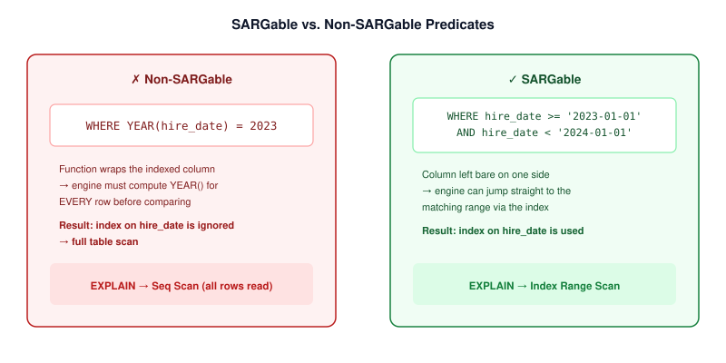
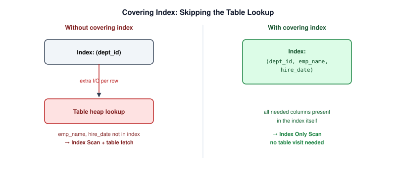
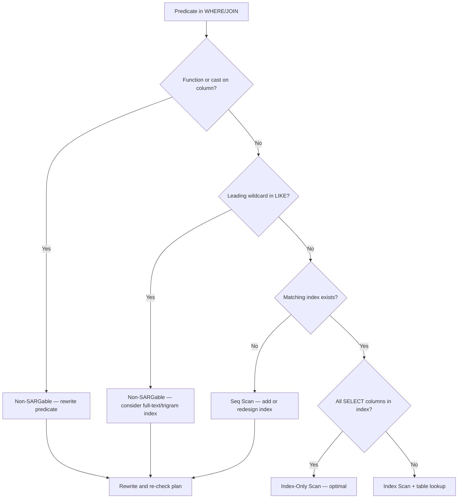

# SARGability and Index Usage

> **Module 16 · Query Optimization**
> [Home](./README.md) · [Engineering Guide](./ENGINEERING_GUIDE.md) · [Cheatsheet](./CHEATSHEET.md) · [Rewrite Cookbook](./REWRITE_COOKBOOK.md)
>
> **Lesson 03 of 07** · [← EXPLAIN](./02_EXPLAIN_AND_EXECUTION_PLANS.md) · [Next: Joins →](./04_JOIN_OPTIMIZATION.md) · [SQL Lab](./03_SARGABILITY_AND_INDEX_USAGE.sql) · [Lab Benchmark](./performance_lab/README.md)

---

## Introduction

An index doesn't help just because it exists — it has to be **usable** for
the specific way a predicate is written. This lesson covers the single most
common reason a "properly indexed" production query still runs a full table
scan: the predicate isn't SARGable.

## Learning Objectives

- Define SARGable ("Search ARGument-able") and identify SARGable vs.
  non-SARGable predicates on sight
- Rewrite common non-SARGable patterns into SARGable equivalents
- Understand composite index column order and selectivity
- Explain what a covering index is and why it avoids a table lookup entirely

## Why This Exists

Teams routinely add an index, watch the query stay slow, and conclude
"indexes don't work here" — when the real problem is that the `WHERE`
clause wraps the indexed column in a function or implicit conversion,
making the index invisible to the optimizer. This is the highest-leverage,
most commonly misunderstood topic in practical query tuning.

## Business Motivation

An HR system needs "everyone hired in 2023":

```sql
-- Looks reasonable. Is not SARGable.
SELECT emp_name, hire_date
FROM employes
WHERE YEAR(hire_date) = 2023;
```

Even with an index on `hire_date`, this query cannot use it — the engine
must compute `YEAR(hire_date)` for *every row* before it can compare
against `2023`, which requires reading every row regardless of any index.

## What "SARGable" Means



A predicate is SARGable when the engine can use an index to jump directly
to matching rows, instead of having to evaluate an expression against every
row first. The rule of thumb: **the indexed column must appear alone, on
one side of the comparison, with nothing applied to it.**

| Non-SARGable | SARGable rewrite |
|---|---|
| `WHERE YEAR(hire_date) = 2023` | `WHERE hire_date >= '2023-01-01' AND hire_date < '2024-01-01'` |
| `WHERE UPPER(emp_name) = 'AMMAR'` | `WHERE emp_name = 'Ammar'` (or a case-insensitive collation/index) |
| `WHERE dept_id + 1 = 5` | `WHERE dept_id = 4` |
| `WHERE emp_name LIKE '%mmar'` | `WHERE emp_name LIKE 'Ammar%'` (leading wildcard defeats standard B-tree indexes) |
| `WHERE CAST(dept_id AS VARCHAR) = '4'` | `WHERE dept_id = 4` (avoid implicit/explicit type conversion on the column) |

The pattern in every "non-SARGable" row: something is applied **to the
column itself**. The pattern in every fix: the column is left bare, and any
transformation happens to the **constant** instead.

## Composite Indexes and Column Order

An index on `(dept_id, hire_date)` supports:
- `WHERE dept_id = 4` ✅ (uses the leading column)
- `WHERE dept_id = 4 AND hire_date > '2023-01-01'` ✅ (uses both, in order)

But does **not** efficiently support:
- `WHERE hire_date > '2023-01-01'` alone ❌ — this skips the leading column,
  so the index mostly can't be used (this is the "leftmost prefix" rule)

Column order in a composite index should generally put the
**highest-selectivity, most frequently equality-filtered** column first.

## Selectivity

**Selectivity** = how much a predicate narrows down the row set. `dept_id`
(a handful of distinct values across millions of rows) is low-selectivity;
an index on it alone helps far less than an index on a near-unique column
like `emp_id`. Extremely low-selectivity columns (e.g., a boolean flag with
90% `TRUE`) often aren't worth indexing at all — the optimizer may
correctly choose a sequential scan over such an index anyway.

## Covering Indexes



### Index Usage Decision Flow



A **covering index** includes every column a query needs, so the engine can
answer entirely from the index without a separate lookup into the table
(an "Index Only Scan" in `EXPLAIN` output — see Lesson 02):

```sql
-- Index: (dept_id, emp_name, hire_date)
SELECT emp_name, hire_date
FROM employes
WHERE dept_id = 4;
```

Because `emp_name` and `hire_date` are both present in the index, the
engine never has to visit the underlying table row.

## Engineering Notes

- Adding an index has a write-side cost (every `INSERT`/`UPDATE` maintains
  every index on that table) — indexing is always a read/write tradeoff,
  never a free performance upgrade.
- Implicit type conversion is a silent SARGability killer: comparing an
  `INT` column against a string literal, or a `VARCHAR` column against an
  unquoted number, can force a conversion on every row.

## MySQL / PostgreSQL / SQL Server Notes

- **PostgreSQL** supports **functional/expression indexes**
  (`CREATE INDEX ON employes (UPPER(emp_name))`) that make certain
  "non-SARGable" patterns SARGable again — at the cost of maintaining an
  extra index.
- **SQL Server** query plans explicitly show "Index Seek" (SARGable, cheap)
  vs. "Index Scan" (the whole index was read — often a sign of poor
  selectivity or a non-SARGable predicate).
- **MySQL** (InnoDB) composite indexes strictly follow the leftmost-prefix
  rule described above.

## Common Mistakes

- Wrapping the indexed column in a function in the `WHERE` clause
- Using a leading wildcard in `LIKE '%text'`
- Assuming an index helps without checking column order in a composite
  index against the actual query's filter columns
- Over-indexing: adding an index for every possible filter combination,
  which slows down writes without meaningfully speeding up reads

## Anti-patterns

- `WHERE column IS NOT NULL` on a column indexed without a partial/filtered
  index — often can't use the index efficiently
- `WHERE column != value` — inequality predicates are frequently
  low-selectivity and often skip the index in favor of a scan

## Interview Questions

- "What does SARGable mean, and can you give an example of a non-SARGable
  predicate and its fix?"
- "You have a composite index on `(a, b)`. Does a query filtering only on
  `b` use it efficiently? Why or why not?"

## Edge Cases

- **Collation mismatches**: comparing a case-sensitive-collated column
  against a case-insensitive literal (or joining two text columns with
  different collations) can silently defeat an index even though no
  function is visibly wrapping the column.
- **Type-widening implicit conversions**: comparing a `SMALLINT` column
  against a literal the engine treats as `BIGINT` can force a conversion
  on the column side in some engines — the SARGability rule is easy to
  violate without any function call being visible in the SQL at all.

## Troubleshooting Guidance

- Index exists, matches the filter column, and the query is still slow →
  check `EXPLAIN` for whether the index was actually chosen; if not, check
  selectivity (is the filter actually narrowing the row set?) and whether
  statistics are current.
- Composite index exists but isn't used for a query using its later
  columns → check the leftmost-prefix rule (Lesson 03) before assuming the
  index is broken.

## Scalability Considerations

Every index added is write overhead on every future `INSERT`/`UPDATE`/
`DELETE` that touches indexed columns. At high write throughput, indexing
decisions are a genuine tradeoff against write latency — audit existing
indexes for actual read usage (most engines expose index-usage statistics)
before adding new ones, rather than only ever adding.

## Additional Dialect Notes

- **Oracle**: supports function-based indexes directly, similar to
  PostgreSQL's expression indexes, letting you index `UPPER(column)` etc.
  explicitly.
- **SQLite**: supports partial indexes (`CREATE INDEX ... WHERE ...`) since
  3.8.0, useful for indexing only a frequently-queried subset of rows.
- **DuckDB**: as a columnar analytical engine, relies more on automatic
  zone maps (min/max per column chunk) than traditional B-tree indexes —
  SARGability still matters, but the mechanism differs from row-store
  engines.

## Summary

An index is a promise, not a guarantee — the `WHERE` clause has to be
written so the optimizer can actually keep that promise. SARGability is the
single check to run first whenever "I added an index and it didn't help."

## Practice Challenges

1. Rewrite `WHERE dept_id * 1 = 4` to be SARGable (trick question — spot
   why it's already effectively non-SARGable and fix it).
2. Given an index on `(location_id, dept_name)`, write one query that uses
   it efficiently and one that cannot, and explain why for each.

## Real Company Usage

- **Airbnb**: Listing search with OR across city/neighborhood columns — neither single index served the combined predicate efficiently ([Incident #6](./PRODUCTION_INCIDENTS.md)).
- **Netflix**: Partial index on `content_rating IS NOT NULL` fixed post-migration Seq Scan ([Incident #1](./PRODUCTION_INCIDENTS.md)).
- **Shopify**: Index bloat from over-indexing (47 indexes on orders table) caused Black Friday degradation ([Incident #7](./PRODUCTION_INCIDENTS.md)).

## Production Applications

- First check when "I added an index and it didn't help"
- Required review for every WHERE clause in production SQL
- Composite index design for multi-column filter + ORDER BY patterns

## Performance Notes

- Every index adds write overhead — audit before adding ([PERFORMANCE_SMELLS #47](./PERFORMANCE_SMELLS.md))
- Low-selectivity columns (boolean flags, status enums) often aren't worth indexing alone
- Functional/expression indexes (PostgreSQL, Oracle) can restore SARGability for required function forms

## Optimization Notes

- Before adding an index, confirm the predicate is SARGable — an index on `hire_date` cannot help `WHERE YEAR(hire_date) = 2023` until you rewrite to a range.
- Design composite indexes with the highest-selectivity equality column first, then range/sort columns — `(dept_id, hire_date)` supports `WHERE dept_id = 4 ORDER BY hire_date` efficiently.
- A covering index that includes all SELECT columns eliminates the table lookup entirely — check for `Index Only Scan` (PostgreSQL) or `Key Lookup` absence in the plan.

## Interview Insight

SARGability questions test whether you understand *why* indexes fail, not just *when* to add them. Strong answers rewrite the predicate, explain the leftmost-prefix rule for composite indexes, and mention covering indexes as the next optimization step. Weak answers stop at "add an index on that column." Interviewers also probe leading-wildcard `LIKE` patterns — know that standard B-tree indexes cannot help `%value` searches.

## Further Experiments

1. Create an index on `hire_date`, run the non-SARGable `YEAR(hire_date) = 2023` query with `EXPLAIN`, then rewrite to a date range and compare plans.
2. Build a composite index `(dept_id, hire_date)` and test three queries: filter on `dept_id` alone, filter on both columns, and filter on `hire_date` alone — observe the leftmost-prefix rule.
3. Complete the [SARGability Benchmark](./performance_lab/README.md) — measure the function-on-column → range rewrite → covering index progression.

## Continue Learning

- Next: [Lesson 04 — Join Optimization](./04_JOIN_OPTIMIZATION.md)
- Lab: [performance_lab/ — SARGability Benchmark](./performance_lab/README.md)
- Cookbook: [REWRITE_COOKBOOK #1, #10, #11](./REWRITE_COOKBOOK.md)

## Related Modules

[`02_EXPLAIN`](./02_EXPLAIN_AND_EXECUTION_PLANS.md) · [`04_Join Optimization`](./04_JOIN_OPTIMIZATION.md) · [`06_Anti-Patterns`](./06_COMMON_PERFORMANCE_ANTI_PATTERNS.md)

## Further Reading

- Use-the-index-luke.com — "SARGable" and "Anatomy of an Index" chapters
- PostgreSQL documentation: "Index-Only Scans and Covering Indexes"
- [DECISION_TREE.md — Tree 2: Index vs Rewrite](./DECISION_TREE.md)
- [Performance_lab/](./Performance_lab/) — hands-on SARGability benchmark at multi-million-row scale
