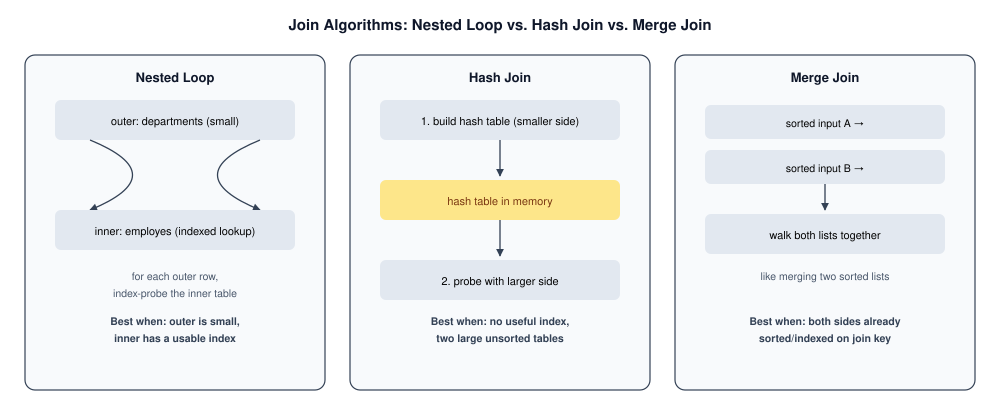
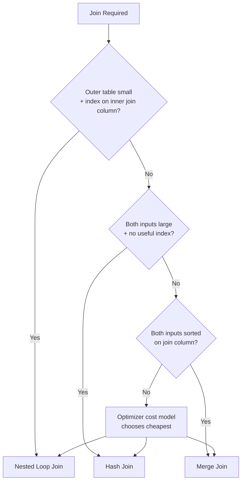
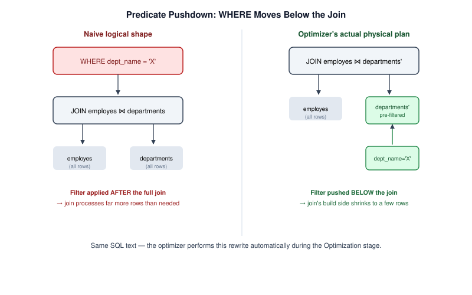

# Join Optimization

> **Module 16 · Query Optimization**
> [Home](./README.md) · [Engineering Guide](./ENGINEERING_GUIDE.md) · [Cheatsheet](./CHEATSHEET.md) · [Decision Trees](./DECISION_TREE.md)
>
> **Lesson 04 of 07** · [← SARGability](./03_SARGABILITY_AND_INDEX_USAGE.md) · [Next: Subqueries →](./05_SUBQUERY_AND_CTE_OPTIMIZATION.md) · [SQL Lab](./04_JOIN_OPTIMIZATION.sql)

---

## Introduction

You already know how to write a `JOIN`. This lesson covers what the
optimizer does *with* it — which of three join algorithms it picks, why,
and when you can influence that choice.

## Learning Objectives

- Describe nested loop, hash, and merge join algorithms and when each is
  chosen
- Explain predicate pushdown and join elimination
- Predict which join algorithm the optimizer will likely choose for a given
  table-size scenario

## Why This Exists

`JOIN` syntax is one line of SQL, but the optimizer's choice of *how* to
execute it can be the single biggest factor in a query's runtime — the same
join written the same way can run a hundred times faster or slower purely
based on table sizes and indexes, with no SQL changes at all.

## Business Motivation

An e-commerce reporting query joins `orders` (200M rows) against a small
`promotions` lookup table (40 rows) to tag which orders used a promo code.
The optimizer's choice here — probably a hash join or even a broadcast-style
join of the tiny table — is completely different from joining two
similarly-huge tables, where a merge or hash join on indexed/sorted keys
dominates. Understanding *why* the optimizer picks differently for these
two shapes is what separates "I can write a JOIN" from "I understand joins."

## The Three Join Algorithms



### Nested Loop Join

```text
for each row in outer_table:
    for each matching row in inner_table (often via an index):
        emit joined row
```

Efficient when the outer table is small and the inner table has a usable
index on the join column — the classic case of joining a small `departments`
table against a large `employes` table filtered down to a small subset.
Becomes very expensive if the outer table is large and there's no index to
speed up the inner lookup, since it degrades toward comparing every row
against every row.

### Hash Join

```text
1. Build a hash table from the smaller input, keyed on the join column
2. Probe the hash table with each row of the larger input
```

The default choice for joining two large tables with no useful index on the
join column — no ordering or index required, and it scales well as long as
the smaller (build) side fits comfortably in memory.

### Merge Join

```text
1. Ensure both inputs are sorted on the join column (via index or explicit sort)
2. Walk both sorted inputs together, like merging two sorted lists
```

Very efficient when both inputs are already sorted on the join column —
typically because both have an index on it — since it avoids building any
in-memory structure. Expensive if the engine has to sort one or both sides
first just to enable the merge.

## How the Optimizer Chooses



The optimizer estimates the cost of each algorithm for the specific tables,
sizes, and available indexes involved, and picks the lowest estimated cost.
This is why the same JOIN syntax in your query can compile to different
physical algorithms depending on: table sizes, whether either join column
is indexed, and current statistics.

## Predicate Pushdown (recap in a join context)



```sql
SELECT e.emp_name, d.dept_name
FROM employes e
JOIN departments d ON e.dept_id = d.dept_id
WHERE d.location_id = 3;
```

The optimizer typically filters `departments` down to `location_id = 3`
**before** performing the join — pushing the `WHERE` predicate down past
the join boundary — rather than joining everything first and filtering
after. This dramatically shrinks the join's build/probe side.

## Join Elimination

If a query joins a table but never actually references any of its columns
in `SELECT`, `WHERE`, or elsewhere, and a foreign key guarantees the join
can't change the row count or filter anything, a sufficiently smart
optimizer can eliminate the join entirely. This mostly benefits
auto-generated ORM SQL that joins defensively; it's worth knowing this
exists so you don't manually "optimize away" a join the optimizer would
have removed anyway.

## Engineering Notes

- Join **order** in your SQL text does not dictate join **execution** order
  — the optimizer is free to reorder joins (subject to correctness) to
  minimize intermediate result sizes.
- The join algorithm choice is visible directly in `EXPLAIN` output as
  `Nested Loop`, `Hash Join`, or `Merge Join` (PostgreSQL naming; other
  engines use similar labels).

## MySQL / PostgreSQL / SQL Server Notes

- **MySQL** historically leaned heavily on nested loop joins (its "Block
  Nested Loop" variant); native hash join support was added in 8.0.18+.
- **PostgreSQL** freely chooses among all three algorithms based on cost.
- **SQL Server** exposes join type directly in its execution plan icons
  (Nested Loops, Hash Match, Merge Join).

## Common Mistakes

- Assuming `JOIN` order in the SQL text controls execution order
- Adding an index and expecting the optimizer to switch to a merge join
  when the data volumes still favor a hash join
- Joining tables you don't need (no columns selected or filtered from them)
  purely out of ORM habit

## Anti-patterns

- Joining on a non-indexed, non-SARGable expression (e.g.,
  `ON UPPER(e.dept_code) = UPPER(d.code)`), which forces a nested loop with
  no usable index on either side
- Joining a huge fact table to another huge fact table with neither side
  indexed on the join key, forcing an expensive hash join with a large
  build side

## Interview Questions

- "Explain the difference between a hash join and a merge join, and when
  each is preferred."
- "Why doesn't the order you write JOINs in SQL determine execution order?"

## Edge Cases

- **Join order explosion**: queries joining many tables (8+) can exceed
  the optimizer's ability to exhaustively evaluate every possible join
  order within a reasonable planning time — most engines fall back to
  heuristics or genetic-algorithm-style search beyond a threshold
  (PostgreSQL's `join_collapse_limit` / `geqo_threshold`), which can
  produce a suboptimal plan for very wide joins.
- **Hash join spilling to disk**: if the build side of a hash join is
  larger than available working memory, the engine spills to disk,
  turning an expected in-memory operation into an I/O-bound one — visible
  in `EXPLAIN ANALYZE` as a sudden jump in actual time relative to
  estimated cost.

## Troubleshooting Guidance

- A join that was fast suddenly spills/slows down → check whether the
  build-side table grew past available working memory (`work_mem` in
  PostgreSQL) rather than assuming the join algorithm choice itself is wrong.
- Many-table join taking a long time just to *plan* (not execute) → check
  join-order search limits/heuristics for your engine.

## Scalability Considerations

In distributed/MPP engines (Redshift, Snowflake, BigQuery), join cost
includes a **data shuffle** step to co-locate matching rows across nodes —
a dimension that doesn't exist in single-node engines. Joining on a
poorly-distributed key can dominate query time even when the same join
would be trivial on a single-node database.

## Additional Dialect Notes

- **Oracle**: supports explicit join-method hints (`USE_NL`, `USE_HASH`,
  `USE_MERGE`) for cases where the optimizer's default choice needs manual
  override.
- **SQLite**: only implements nested loop joins — there's no hash or merge
  join to choose between, which matters when reasoning about its
  performance characteristics on large joins.
- **DuckDB**: implements a vectorized hash join as its primary join
  strategy, well-suited to its analytical, columnar workload profile.

## Summary

The optimizer picks a join algorithm based on table sizes, available
indexes, and estimated cost — not based on how you wrote the SQL. Your job
is to give it good indexes and accurate statistics; its job is to pick
nested loop, hash, or merge accordingly.

## Practice Challenges

1. For a join between a 50-row `locations` table and a 40-million-row
   `employes`-derived table, predict the likely join algorithm and explain
   why.
2. Find a query in Module 03 that joins three tables and predict, before
   running `EXPLAIN`, which join is likely to be the most expensive.

## Real Company Usage

- **Amazon**: 10-table warehouse inventory join exceeded planning time budget — join order explosion required staged CTEs ([Incident #8](./PRODUCTION_INCIDENTS.md)).
- **Uber**: Hash join spill to disk when build side exceeded work_mem during peak driver earnings computation.
- **Airbnb**: BitmapOr merge of two index scans for OR-across-columns search — 8 seconds vs. 45ms with UNION ALL rewrite.

## Production Applications

- Predicting join algorithm before running EXPLAIN (interview skill)
- Diagnosing hash join spills visible as `Batches > 1` in PostgreSQL
- Predicate pushdown verification for multi-table queries

## Performance Notes

- Join order in SQL text does not control execution order
- Hash join spilling to disk is a common cause of sudden 10× slowdown after data growth
- Distributed engines (Snowflake, BigQuery) add data shuffle cost not present in single-node engines

## Optimization Notes

- Ensure an index exists on the inner side of nested loop joins — without it, nested loop degrades toward O(n²).
- Watch for `Hash Join` with `Batches > 1` in PostgreSQL — this means the build side exceeded `work_mem` and spilled to disk; increase `work_mem` or reduce build-side rows via predicate pushdown.
- Push filters into JOIN conditions (`ON e.dept_id = d.dept_id AND d.dept_name = 'Engineering'`) so the optimizer applies them before the join, not after.

## Interview Insight

"Which join algorithm would you expect here?" is a classic systems-design question. Interviewers give table sizes and index availability, then expect you to predict nested loop (small outer + indexed inner), hash join (two large unindexed tables), or merge join (both sides pre-sorted). Mentioning hash join spill-to-disk and predicate pushdown separates senior candidates from those who only know the three names.

## Further Experiments

1. Join `departments` (small) to `employes` (large) with and without an index on `employes.dept_id` — compare nested loop vs. hash join in `EXPLAIN ANALYZE`.
2. Create a multi-table query joining three tables and predict join order before running `EXPLAIN` — check whether the optimizer's order matches your prediction.
3. Add a restrictive `WHERE` clause and observe whether the optimizer pushes it below the join node (predicate pushdown) in the plan tree.

## Continue Learning

- Next: [Lesson 05 — Subquery & CTE Optimization](./05_SUBQUERY_AND_CTE_OPTIMIZATION.md)
- Reference: [DECISION_TREE.md — Tree 4: Join Algorithm](./DECISION_TREE.md)
- Practice: [PRACTICE_PROBLEMS.md — Problem 4](./PRACTICE_PROBLEMS.md)

## Related Modules

[`03_SARGability`](./03_SARGABILITY_AND_INDEX_USAGE.md) · [`05_Subquery Optimization`](./05_SUBQUERY_AND_CTE_OPTIMIZATION.md) · [`03_Joins`](../03_Joins)

## Further Reading

- PostgreSQL documentation: "Nested Loop, Hash, and Merge Join" chapters
- [CROSS_DATABASE_ENGINEERING.md](./CROSS_DATABASE_ENGINEERING.md) — join support by engine
