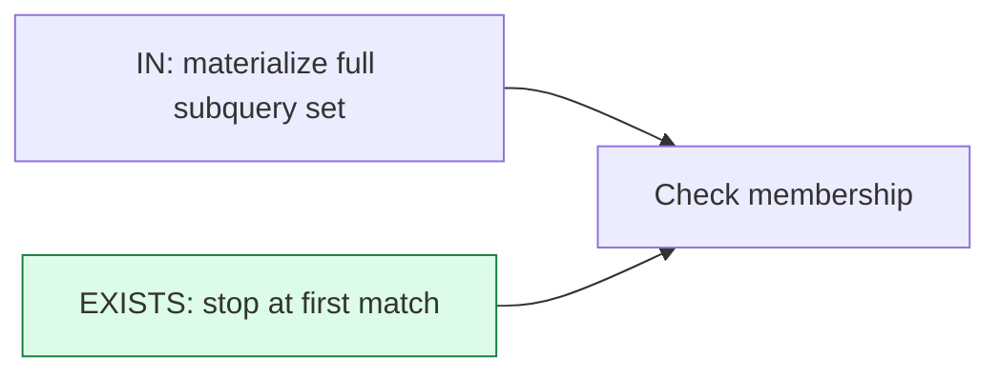

# Subquery and CTE Optimization

> **Module 16 · Query Optimization**
> [Home](./README.md) · [Engineering Guide](./ENGINEERING_GUIDE.md) · [Cheatsheet](./CHEATSHEET.md) · [Rewrite Cookbook](./REWRITE_COOKBOOK.md)
>
> **Lesson 05 of 07** · [← Joins](./04_JOIN_OPTIMIZATION.md) · [Next: Anti-Patterns →](./06_COMMON_PERFORMANCE_ANTI_PATTERNS.md) · [SQL Lab](./05_SUBQUERY_AND_CTE_OPTIMIZATION.sql) · [Lab Benchmark](./performance_lab/subquery_rewrite_benchmark.sql)

---

## Introduction

`IN`, `EXISTS`, correlated subqueries, and CTEs can all express the same
logical question — but they don't always compile to the same physical plan.
This lesson covers when they diverge and how to choose correctly.

## Learning Objectives

- Choose correctly between `IN`, `EXISTS`, and `JOIN` for a given scenario
- Explain why correlated subqueries are often expensive and how to rewrite
  them
- Understand when a CTE is optimization-transparent (inlined by the
  optimizer) versus materialized as a real, separate step

## Why This Exists

These four constructs are functionally interchangeable in many cases, which
tempts SQL authors into using whichever "feels natural" without checking
whether the optimizer treats them identically. It often doesn't.

## Business Motivation

"Which departments have at least one employee hired in the last 30 days?"
can be written four different ways, and at production scale the
performance of these can differ by an order of magnitude depending on the
engine, data distribution, and whether `NULL` values are present in the
subquery's column.

## EXISTS vs. IN



```sql
-- IN
SELECT dept_name
FROM departments d
WHERE d.dept_id IN (
    SELECT dept_id FROM employes WHERE hire_date > CURRENT_DATE - INTERVAL '30 days'
);

-- EXISTS
SELECT dept_name
FROM departments d
WHERE EXISTS (
    SELECT 1 FROM employes e
    WHERE e.dept_id = d.dept_id
      AND e.hire_date > CURRENT_DATE - INTERVAL '30 days'
);
```

- `EXISTS` stops as soon as it finds one matching row per outer row — ideal
  when you only care about "does at least one match exist," not the actual
  matched values.
- `IN` typically has the optimizer build the full subquery result set once,
  then check membership — can be very efficient, **except** when the
  subquery's column can contain `NULL`, which introduces confusing
  three-valued-logic edge cases (`NOT IN` with any `NULL` in the list
  returns no rows at all, a classic production bug).
- Modern cost-based optimizers frequently rewrite `IN` into a semi-join
  plan that performs similarly to `EXISTS` — but this isn't guaranteed
  across all engines/versions, so `EXISTS` is the safer default for
  existence checks, and `NOT EXISTS` is strictly safer than `NOT IN`.

## Correlated Subqueries

A correlated subquery references a column from the outer query, meaning it
conceptually re-runs once per outer row:

```sql
-- Correlated: "each employee's hire_date rank within their own department"
SELECT e.emp_name,
       (SELECT COUNT(*) FROM employes e2
        WHERE e2.dept_id = e.dept_id AND e2.hire_date <= e.hire_date) AS hire_rank
FROM employes e;
```

Naively, this looks like it must literally execute once per outer row — in
practice, good optimizers can rewrite this into a single join-based plan.
But not all engines do this well for all shapes, and this exact "rank
within group" problem has a purpose-built, always-fast alternative: a
window function.

```sql
-- Window function rewrite — same result, no per-row correlated re-execution
SELECT e.emp_name,
       RANK() OVER (PARTITION BY e.dept_id ORDER BY e.hire_date) AS hire_rank
FROM employes e;
```

**Rule of thumb**: if a correlated subquery is computing a per-group rank,
running total, or comparison to peers, a window function (Module 07) is
almost always both clearer and faster than the correlated form.

## CTEs: Inlined vs. Materialized

A CTE is a name for a subquery — it does not automatically mean "computed
once and cached," and it does not automatically mean "always inlined,"
either. Behavior differs by engine:

- **PostgreSQL (12+)**: CTEs are inlined (treated like a subquery, folded
  into the main plan) by default *unless* the CTE is referenced more than
  once, is recursive, or `MATERIALIZED` is explicitly requested.
- **PostgreSQL (< 12)**: CTEs were always materialized as an "optimization
  fence" — a real, separate execution step the rest of the plan couldn't
  see past.
- **SQL Server / MySQL 8+**: generally inline non-recursive CTEs similarly
  to derived tables, subject to their own optimizer rules.

```sql
WITH fraud_dept AS (
    SELECT dept_id FROM departments WHERE dept_name = 'Fraud Review'
)
SELECT e.emp_name
FROM employes e
JOIN fraud_dept fd ON e.dept_id = fd.dept_id;
```

This is optimization-equivalent to writing the subquery inline, on modern
Postgres/SQL Server/MySQL — the CTE here is purely a readability choice,
not a performance one.

## Engineering Notes

- Never assume a CTE improves performance by "computing something once" —
  verify with `EXPLAIN` on your specific engine and version.
- `NOT IN` with a subquery that can return `NULL` is a correctness bug
  waiting to happen, not just a performance concern — prefer `NOT EXISTS`.

## MySQL / PostgreSQL / SQL Server Notes

- **PostgreSQL**: use `WITH x AS MATERIALIZED (...)` to force
  materialization when you specifically want a CTE evaluated once and
  reused, e.g. for a CTE with side effects or one that's genuinely
  expensive and referenced multiple times.
- **SQL Server**: recursive CTEs always execute iteratively; non-recursive
  CTEs are optimizer-transparent like a view.

## Common Mistakes

- Using `NOT IN` against a subquery column that can contain `NULL`
- Assuming a CTE is materialized (or assuming it's inlined) without
  checking your engine's actual default behavior and version
- Writing a correlated subquery for a per-group ranking problem instead of
  a window function

## Anti-patterns

- Correlated subqueries in the `SELECT` list that run once per outer row
  with no possible optimizer rewrite (e.g., calling a non-deterministic or
  side-effecting function inside the subquery)
- Deeply nested CTEs (5+ levels) that make it impossible to reason about
  what's materialized vs. inlined

## Interview Questions

- "When would you choose EXISTS over IN, and why is NOT EXISTS generally
  safer than NOT IN?"
- "Does a CTE always get computed once and cached? Explain for your
  database engine of choice."

## Edge Cases

- **Runaway recursive CTEs**: a recursive CTE without a correct termination
  condition (or with a subtle cycle in the underlying data, e.g. a
  manager/employee hierarchy with an accidental cycle) can loop until it
  hits a resource limit or exhausts memory — always design an explicit
  `UNION` (deduplicating) termination or a depth guard for production
  recursive CTEs.
- **CTE not materializing when you expected it to**: relying on default
  CTE materialization behavior (Lesson 05) without confirming your
  engine/version's actual default can lead to surprising re-execution of
  an "expensive, computed-once" CTE multiple times.

## Troubleshooting Guidance

- Recursive CTE query hangs or runs very long → check for a data cycle in
  the recursive relationship, and confirm a depth/iteration guard exists.
- CTE referenced multiple times performs worse than expected → confirm
  whether it was inlined and recomputed each reference, versus
  materialized once; force materialization explicitly if needed.

## Scalability Considerations

Correlated subqueries that aren't rewritten by the optimizer scale
*per outer row* — on a small outer set this is invisible, but on a
large outer table this is the difference between a query that finishes in
milliseconds and one that never finishes. Always validate correlated
subquery performance against production-scale outer table sizes, not just
sample data.

## Additional Dialect Notes

- **Oracle**: supports the `MATERIALIZE` hint to force a CTE (subquery
  factoring clause) to be computed once and reused, similar to
  PostgreSQL's `MATERIALIZED` keyword.
- **SQLite**: added CTE support in 3.8.3 — verify your target SQLite
  version supports `WITH` before relying on it in embedded applications.
- **DuckDB**: aggressively inlines CTEs by default given its analytical,
  single-query-at-a-time workload profile.

## Summary

`IN`, `EXISTS`, correlated subqueries, and CTEs are tools with different
default behaviors across engines — the fix for "which one is faster" is
always to check `EXPLAIN` for your specific engine and data, not to trust a
rule of thumb blindly. The one true rule of thumb that holds broadly:
prefer `NOT EXISTS` over `NOT IN` for correctness, and prefer window
functions over correlated subqueries for per-group ranking.

## Practice Challenges

1. Rewrite a `NOT IN` subquery from your own past work as `NOT EXISTS` and
   explain the correctness difference if the subquery column can be `NULL`.
2. Take the hire-rank correlated subquery example and confirm via `EXPLAIN`
   that the window function version produces a cheaper plan on your engine.

## Real Company Usage

- **Stripe**: NOT IN NULL trap caused 3-day silent data loss in payment reconciliation — zero emails sent to 450K accounts ([Incident #2](./PRODUCTION_INCIDENTS.md)).
- **Uber**: Correlated scalar subquery in SELECT list caused SEV-1 dashboard outage — 5M SubPlan loops ([Incident #3](./PRODUCTION_INCIDENTS.md)).
- **Financial services**: Correlated aggregate subqueries in reconciliation views replaced with window functions — 6.5 hours → 18 minutes ([Casebook #4](./REAL_WORLD_CASEBOOK.md)).

## Production Applications

- Code review standard: reject NOT IN against nullable columns
- ORM-generated views audited for correlated subqueries in SELECT projections
- CTE materialization verified after PostgreSQL upgrades (behavior changed in PG 12)

## Performance Notes

- Correlated subqueries that aren't decorrelated scale per outer row — invisible at dev scale, catastrophic at production scale
- CTE behavior varies significantly by engine and version — never assume

## Optimization Notes

- Replace `NOT IN (SELECT ...)` with `NOT EXISTS (SELECT 1 ...)` whenever the subquery column is nullable — `NOT IN` returns unknown (treated as false) if any NULL exists, causing silent data loss.
- Correlated scalar subqueries in the SELECT list execute once per outer row — rewrite as a window function (`ROW_NUMBER()`, `RANK()`) or a lateral join for set-based execution.
- On PostgreSQL 12+, use `AS MATERIALIZED` or `AS NOT MATERIALIZED` on CTEs to control whether the engine inlines or materializes — the default changed and can surprise teams after upgrades.

## Interview Insight

Subquery questions often present a correlated subquery and ask you to rewrite it. Interviewers look for: (1) recognizing the per-row execution cost, (2) proposing EXISTS/JOIN/window-function alternatives, (3) knowing the NOT IN NULL trap. For CTEs, mention that PostgreSQL 12+ changed default inlining behavior — this signals production awareness beyond textbook knowledge.

## Further Experiments

1. Write a correlated subquery counting per-department employees, confirm `SubPlan loops=N` in `EXPLAIN ANALYZE`, then rewrite with `COUNT() OVER (PARTITION BY dept_id)`.
2. Test `NOT IN` vs. `NOT EXISTS` with a nullable column in the subquery — verify that `NOT IN` silently drops rows when NULL is present.
3. Complete the [Subquery Rewrite Benchmark](./performance_lab/subquery_rewrite_benchmark.sql) and compare elapsed times across rewrite stages.

## Continue Learning

- Next: [Lesson 06 — Anti-Patterns](./06_COMMON_PERFORMANCE_ANTI_PATTERNS.md)
- Lab: [performance_lab/subquery_rewrite_benchmark.sql](./performance_lab/subquery_rewrite_benchmark.sql)
- Cookbook: [REWRITE_COOKBOOK #3, #7, #8, #9](./REWRITE_COOKBOOK.md)

## Related Modules

[`04_Subqueries`](../04_Subqueries) · [`06_CTEs`](../06_CTEs) · [`07_Window_Functions`](../07_Window_Functions)

## Further Reading

- PostgreSQL documentation: "CTE MATERIALIZED / NOT MATERIALIZED" (12+)
- Use-the-index-luke.com — "EXISTS vs. IN vs. JOIN" chapter
- [REWRITE_COOKBOOK.md](./REWRITE_COOKBOOK.md) — canonical rewrites
- [Performance_lab/subquery_rewrite_benchmark.sql](./Performance_lab/subquery_rewrite_benchmark.sql) — hands-on correlated-subquery-vs-window-function benchmark
