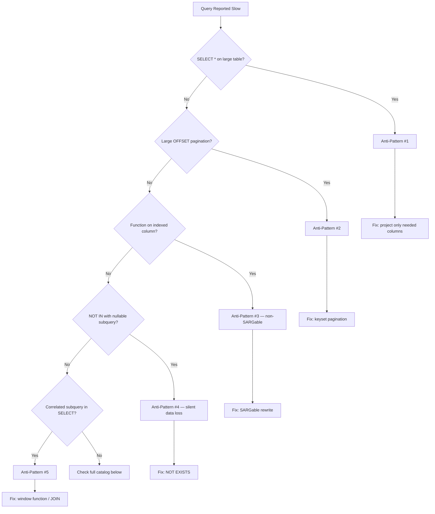

# Common Performance Anti-Patterns

> **Module 16 · Query Optimization**
> [Home](./README.md) · [Engineering Guide](./ENGINEERING_GUIDE.md) · [Performance Smells](./PERFORMANCE_SMELLS.md) · [Checklist](./PERFORMANCE_CHECKLIST.md)
>
> **Lesson 06 of 07** · [← Subqueries](./05_SUBQUERY_AND_CTE_OPTIMIZATION.md) · [Next: Workflow →](./07_QUERY_TUNING_WORKFLOW.md) · [SQL Lab](./06_COMMON_PERFORMANCE_ANTI_PATTERNS.sql) · [Lab Benchmark](./performance_lab/pagination_benchmark.sql)

---

## Introduction

This lesson is a reference catalog, not a linear tutorial: the recurring
mistakes that show up across almost every production SQL codebase,
independent of engine or business domain. Recognizing these on sight is
often faster than deriving them from first principles under deadline
pressure.

## Learning Objectives

- Recognize at least eight common performance anti-patterns on sight
- Explain the underlying reason each one is expensive (not just that it is)
- Know the standard fix for each

## Why This Exists

Most production slowness isn't exotic — it's the same handful of patterns
repeating across teams and companies. A reviewer who can spot these in a
pull request prevents the incident before it happens.

## The Anti-Pattern Catalog



### 1. `SELECT *`

```sql
-- Anti-pattern
SELECT * FROM employes WHERE dept_id = 4;

-- Fix
SELECT emp_id, emp_name, hire_date FROM employes WHERE dept_id = 4;
```

Pulls unnecessary columns across the network, defeats covering indexes
(Lesson 03), and silently breaks when the table schema changes.

### 2. Functions on indexed columns in `WHERE`

Covered fully in Lesson 03 — `WHERE YEAR(hire_date) = 2023` instead of a
bare-column range comparison.

### 3. Leading wildcard `LIKE`

Covered in Lesson 03 — `LIKE '%text'` cannot use a standard B-tree index.

### 4. `NOT IN` with a nullable subquery

Covered in Lesson 05 — silently returns zero rows if the subquery column
contains any `NULL`. Use `NOT EXISTS`.

### 5. Implicit cross joins (missing join condition)

```sql
-- Anti-pattern -- accidental cartesian product
SELECT e.emp_name, d.dept_name
FROM employes e, departments d
WHERE e.hire_date > '2023-01-01';
-- missing e.dept_id = d.dept_id !

-- Fix
SELECT e.emp_name, d.dept_name
FROM employes e
JOIN departments d ON e.dept_id = d.dept_id
WHERE e.hire_date > '2023-01-01';
```

Produces `rows(employes) × rows(departments)` results — at production
scale this can silently multiply a result set from thousands of rows into
billions, exhausting memory or disk before anyone notices the missing
`JOIN` condition.

### 6. Row-by-row processing (the "RBAR" anti-pattern)

Application code that loops over results and issues one query per row
(`SELECT ... WHERE emp_id = ?` inside a loop of 10,000 IDs) instead of a
single set-based query (`WHERE emp_id IN (...)` or a bulk join). Each
round-trip pays full parsing/planning/network overhead per row.

### 7. Over-indexing

Adding an index for every column that ever appears in any `WHERE` clause.
Every additional index adds write overhead to every `INSERT`/`UPDATE`/
`DELETE` on that table — indexing is a tradeoff, not a free upgrade (see
Lesson 03).

### 8. `OR` conditions across different columns defeating index usage

```sql
-- Often can't use a single index efficiently
SELECT emp_name FROM employes
WHERE dept_id = 4 OR hire_date > '2023-01-01';

-- Often better as a UNION of two independently-indexable queries
SELECT emp_name FROM employes WHERE dept_id = 4
UNION
SELECT emp_name FROM employes WHERE hire_date > '2023-01-01';
```

A single composite index generally can't serve an `OR` across unrelated
columns the way it can serve an `AND`; splitting into a `UNION` lets each
half use its own index.

### 9. Pagination via large `OFFSET`

```sql
-- Anti-pattern -- gets progressively slower as OFFSET grows, because the
-- engine must still generate and discard all skipped rows
SELECT emp_name FROM employes ORDER BY emp_id LIMIT 20 OFFSET 100000;

-- Fix -- keyset/cursor pagination
SELECT emp_name FROM employes
WHERE emp_id > 100000
ORDER BY emp_id
LIMIT 20;
```

### 10. Unnecessary `DISTINCT`

Used as a reflex to "clean up" duplicate rows caused by an unintended
one-to-many join, instead of fixing the join itself. `DISTINCT` requires a
full sort/hash-dedup step — it treats a modeling problem as a performance
tax.

## Engineering Notes

Most of these anti-patterns share a root cause: writing SQL that describes
"what I want" without checking whether it also accidentally describes "scan
everything" or "multiply everything." `EXPLAIN` (Lesson 02) is how you
catch this before it becomes a production incident.

## Common Mistakes

Treating this list as exhaustive — it's the *common* catalog, not the
complete one. Every engine and schema has its own quirks; use this list as
a starting checklist, not a substitute for reading your own `EXPLAIN`
output.

## Interview Questions

- "Name three SQL anti-patterns and explain why each one is expensive."
- "Why does a large OFFSET get slower as it grows, even with an index on
  the ORDER BY column?"

## Edge Cases

- **The N+1 query pattern**: an ORM or application loop that issues one
  query per parent row to fetch related child rows (e.g. one query per
  employee to fetch their department) instead of a single joined or
  batched query — invisible in a dev environment with 10 rows, catastrophic
  in production with 100,000.
- **Anti-patterns that only appear at scale**: a query with an OR across
  columns (item 8) or an unindexed correlated subquery can look completely
  fine in a small staging dataset and only reveal its cost once production
  data volume is reached — "it works in staging" is not evidence of
  production performance.

## Troubleshooting Guidance

- Application is slow with high query volume, not a single obviously slow
  query → suspect the N+1 pattern; check application logs/APM for
  repeated near-identical queries in a tight loop.
- A query is fast in dev/staging and slow in production with no code
  difference → suspect data-volume or data-skew differences between
  environments rather than a code regression.

## Scalability Considerations

Most anti-patterns in this catalog are **latent** — correct results at any
data size, but with cost that grows non-linearly as data volume increases.
Treat "fast in testing" as no guarantee at all for OFFSET pagination,
correlated subqueries, or cartesian-product bugs; always test against a
production-representative data volume before shipping.

## Summary

Most production SQL slowness is not exotic — it's one of these ten
recurring patterns. Memorizing this list turns code review from "this
feels slow" into "this is the OFFSET anti-pattern, here's the fix."

## Practice Challenges

1. Find one anti-pattern from this list in code you've written before, and
   rewrite it using the recommended fix.
2. Explain why unnecessary `DISTINCT` is described here as "a modeling
   problem, not a performance problem."

## Real Company Usage

- **GitHub**: OFFSET pagination caused admin panel unusability for enterprise orgs with 50K repos ([Incident #4](./PRODUCTION_INCIDENTS.md)).
- **Logistics platforms**: Accidental cartesian products from comma joins silently multiply result sets from thousands to billions of rows.
- **SaaS platforms**: N+1 query patterns invisible in dev (10 rows) but catastrophic at 100K+ rows in production.

## Production Applications

- Code review checklist item — scan every PR for the 10 catalogued anti-patterns
- Pre-deployment audit of ORM-generated SQL
- Interview preparation — "what's wrong with this query" questions

## Performance Notes

- Most anti-patterns are latent — correct results at any scale, non-linear cost growth
- "Fast in staging" is not evidence of production performance for OFFSET, correlated subqueries, or cartesian bugs

## Optimization Notes

- Scan every production query for `SELECT *` on tables >100K rows — project only needed columns to enable covering indexes and reduce I/O.
- Replace `OFFSET n LIMIT m` pagination with keyset pagination (`WHERE id > @last_id ORDER BY id LIMIT m`) for any user-facing endpoint — OFFSET cost grows linearly with page number.
- Audit ORM-generated SQL for N+1 patterns: one query per parent row in a loop is invisible at 10 rows, catastrophic at 100K.

## Interview Insight

"What's wrong with this query?" is the most common anti-pattern interview format. Interviewers expect you to spot the pattern *and* explain the scaling behavior — e.g., "OFFSET 100000 forces the engine to read and discard 100K rows before returning the page." Naming the fix (keyset pagination, SARGable rewrite, NOT EXISTS) without being prompted signals production experience.

## Further Experiments

1. Run the same paginated query with `OFFSET 0`, `OFFSET 10000`, and `OFFSET 100000` — plot elapsed time and observe linear growth.
2. Find an anti-pattern in your own past SQL, rewrite it, and measure the difference with `EXPLAIN ANALYZE`.
3. Complete the [Pagination Benchmark](./performance_lab/pagination_benchmark.sql) comparing OFFSET vs. keyset at increasing page depths.

## Continue Learning

- Next: [Lesson 07 — Query Tuning Workflow](./07_QUERY_TUNING_WORKFLOW.md)
- Reference: [PERFORMANCE_SMELLS.md](./PERFORMANCE_SMELLS.md) — 55+ smells
- Cookbook: [REWRITE_COOKBOOK.md](./REWRITE_COOKBOOK.md) — fixes for each anti-pattern

## Related Modules

[`03_SARGability`](./03_SARGABILITY_AND_INDEX_USAGE.md) · [`05_Subquery Optimization`](./05_SUBQUERY_AND_CTE_OPTIMIZATION.md) · [`07_Query Tuning Workflow`](./07_QUERY_TUNING_WORKFLOW.md)

## Further Reading

- Use-the-index-luke.com — "Pagination Done the Right Way"
- PostgreSQL wiki: "Slow Query Questions" checklist
- [COMMON_MISTAKES.md](./COMMON_MISTAKES.md) — 12 frequent mistakes
- [Performance_lab/pagination_benchmark.sql](./Performance_lab/pagination_benchmark.sql) — hands-on OFFSET-vs-keyset pagination benchmark
