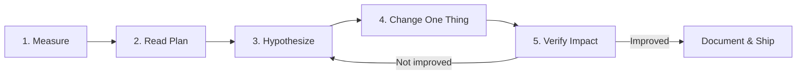

# Query Tuning Workflow

> **Module 16 · Query Optimization**
> [Home](./README.md) · [Engineering Guide](./ENGINEERING_GUIDE.md) · [Troubleshooting](./TROUBLESHOOTING_GUIDE.md) · [Playbook](./OPTIMIZATION_PLAYBOOK.md)
>
> **Lesson 07 of 07** · [← Anti-Patterns](./06_COMMON_PERFORMANCE_ANTI_PATTERNS.md) · [Performance Lab →](./performance_lab/README.md)

---

## Introduction

Every technique in this module is a tool. This lesson is the process that
tells you which tool to reach for, in what order, so tuning becomes
repeatable instead of improvised.

## Learning Objectives

- Follow a five-step, repeatable query tuning workflow
- Know what to check first, second, and last when a query is reported slow
- Understand how to monitor for slow queries proactively, not just reactively

## The Workflow


```text
1. MEASURE        →  2. READ THE PLAN  →  3. FORM A HYPOTHESIS
                                                    ↓
5. VERIFY IMPACT  ←  4. CHANGE ONE THING
```



### 1. Measure

Get an actual baseline — `EXPLAIN ANALYZE`, not a guess, not "it feels
slow." Note actual elapsed time, not just estimated cost.

### 2. Read the Plan

Find the single most expensive node (Lesson 02). Resist the urge to "fix"
something before you've identified the actual bottleneck — a common mistake
is optimizing a JOIN when the real cost is a downstream `Sort` for
`ORDER BY`.

### 3. Form a Hypothesis

Match the expensive node to a known cause:

| Symptom in plan | Likely cause | Relevant lesson |
|---|---|---|
| `Seq Scan` on a large, filtered table | Missing index, or non-SARGable predicate | 03 |
| Large gap between estimated and actual rows | Stale statistics | 01, 02 |
| `Nested Loop` with no index on the inner side | Missing join-column index | 04 |
| Unexpectedly expensive `Hash`/build step | Join order or missing predicate pushdown | 04 |
| `Sort` before a `LIMIT`/`ORDER BY` | Missing index matching the sort order | 03, 06 |
| Subquery/correlated-subquery node with high cost | Rewrite as JOIN/EXISTS/window function | 05 |

### 4. Change One Thing

Make exactly one change — add one index, rewrite one predicate, restructure
one subquery. Changing multiple things at once means you can't attribute
the improvement (or regression) to a specific cause, and you lose the
ability to build a reliable mental model for next time.

### 5. Verify Impact

Re-run `EXPLAIN ANALYZE` and compare directly against your Step 1 baseline.
If it didn't help, revert the change and return to Step 3 with a new
hypothesis — don't stack unproven changes on top of each other.

## Proactive Monitoring (Enterprise Workflow)

Waiting for a user complaint is the slowest possible way to find a slow
query. Production teams typically:

- Enable **slow query logging** (MySQL's `slow_query_log`, PostgreSQL's
  `log_min_duration_statement`) to capture anything over a threshold
  automatically
- Track **query plan changes over time** for the same SQL text (SQL
  Server's Query Store, or `pg_stat_statements` on PostgreSQL) to catch a
  plan that silently got worse after a statistics change or data growth
- Run `ANALYZE` / `UPDATE STATISTICS` on a schedule so the optimizer's
  cost estimates stay accurate as tables grow

## Engineering Notes

- Most production performance regressions are not "the query changed" —
  they're "the data changed" (grew, or its distribution shifted) and the
  execution plan silently followed. This is why plan-change monitoring
  matters as much as query-text review.
- A tuning change that helps one query can hurt another (a new index speeds
  up reads but slows down writes elsewhere) — always consider the whole
  workload, not just the query in front of you.

## Common Mistakes

- Changing multiple things at once and being unable to explain which change
  actually helped
- Tuning based on estimated cost from `EXPLAIN` alone on an already-slow
  query, instead of `EXPLAIN ANALYZE`'s actual numbers
- Adding an index without checking whether an equivalent one already exists

## Interview Questions

- "Walk me through how you'd approach a report that 'used to be fast and
  now isn't,' with no code changes in the interim."
- "Why is changing one thing at a time important in query tuning?"

## Edge Cases

- **Intermittent slowness**: a query that's fast 95% of the time and slow
  5% of the time is often not a plan problem at all — check for lock
  contention, connection pool exhaustion, or resource contention from other
  concurrent workloads before assuming the execution plan itself is
  unstable.
- **Can't reproduce locally**: a query that's slow only in production and
  fast locally almost always reflects a data-volume or data-distribution
  difference — pull real production statistics (row counts, value
  distributions) rather than trying to "guess" a representative local
  dataset.

## Troubleshooting Guidance

- Before assuming a query-tuning problem, rule out: lock contention,
  connection saturation, and resource contention from concurrent queries —
  all of which look like "slow query" symptoms but need different fixes
  than anything in this module.

## Scalability Considerations

Tuning a single query is workload-unaware by design — Lesson 07's
five-step loop optimizes one query at a time. At the workload level, teams
also need to watch for the aggregate effect of many "individually fine"
queries competing for the same resources (connection pool limits, cache
contention, I/O bandwidth) — a class of problem query-level `EXPLAIN`
tuning alone won't surface.

## Summary

Query tuning is a loop, not a single action: measure, read the plan, form a
hypothesis grounded in the patterns from this module, change one thing,
verify. This workflow is what turns Lessons 01–06 from a list of trivia
into an applied engineering skill.

## Practice Challenges

1. Take any query from an earlier module, add `EXPLAIN ANALYZE`, and walk
   through all five workflow steps even if the query is already fast —
   practice the process on a low-stakes example first.
2. Describe how you'd set up proactive slow-query monitoring for a small
   analytics team with no dedicated DBA.

## Real Company Usage

- **Datadog**: Query performance monitoring integrated into the five-step workflow — `pg_stat_statements` top-N queries reviewed weekly, plan regressions flagged automatically.
- **Shopify**: Black Friday runbook includes pre-event `ANALYZE` on all order tables and baseline `EXPLAIN ANALYZE` snapshots for top 20 queries.
- **Stripe**: Every query touching >1M rows requires `EXPLAIN ANALYZE` in the PR description before merge.

## Production Applications

- Standard operating procedure for every query performance incident
- Pre-deployment checklist item for analytics and backend teams
- Onboarding exercise: new engineers walk through the five steps on a known-slow query in staging

## Performance Notes

- The workflow is deliberately single-query focused — at the workload level, also monitor aggregate connection pool usage and cache hit ratios
- Document every tuning change with before/after `EXPLAIN ANALYZE` output — future you (or the next engineer) needs the baseline

## Optimization Notes

- Step 1 (Measure) must use `EXPLAIN ANALYZE`, not developer intuition — "feels slow" is not a baseline.
- Step 4 (Change One Thing) is the most violated rule in practice — resist the urge to add an index *and* rewrite a subquery simultaneously.
- After fixing, add the query to proactive monitoring (`pg_stat_statements`, slow query log) so the next regression is caught before users complain.

## Interview Insight

"Walk me through how you'd tune a slow query" is the capstone interview question for this module. Strong candidates follow the five steps in order, mention checking for lock contention before assuming a plan problem, and emphasize changing one thing at a time. Mentioning proactive monitoring (`pg_stat_statements`, Query Store) signals you've operated in production, not just studied theory.

## Further Experiments

1. Pick the slowest query in your current project and walk through all five workflow steps — document each step's output even if the query is already fast.
2. Enable `pg_stat_statements` (PostgreSQL) or slow query log (MySQL) on a dev instance and identify the top 5 queries by total time.
3. Save an `EXPLAIN ANALYZE` baseline today; after your next bulk data import, re-run and check whether the plan changed without any SQL modification.

## Continue Learning

- Reference: [TROUBLESHOOTING_GUIDE.md](./TROUBLESHOOTING_GUIDE.md) — symptom-first diagnostic flowchart
- Reference: [OPTIMIZATION_PLAYBOOK.md](./OPTIMIZATION_PLAYBOOK.md) — structured tuning sequences
- Reference: [PERFORMANCE_CHECKLIST.md](./PERFORMANCE_CHECKLIST.md) — pre-merge checklist

## Related Modules

[`01_Query Execution Lifecycle`](./01_QUERY_EXECUTION_LIFECYCLE.md) · [`02_EXPLAIN`](./02_EXPLAIN_AND_EXECUTION_PLANS.md) · [`06_Anti-Patterns`](./06_COMMON_PERFORMANCE_ANTI_PATTERNS.md)

## Further Reading

- PostgreSQL documentation: `pg_stat_statements` extension
- MySQL documentation: "The Slow Query Log"
