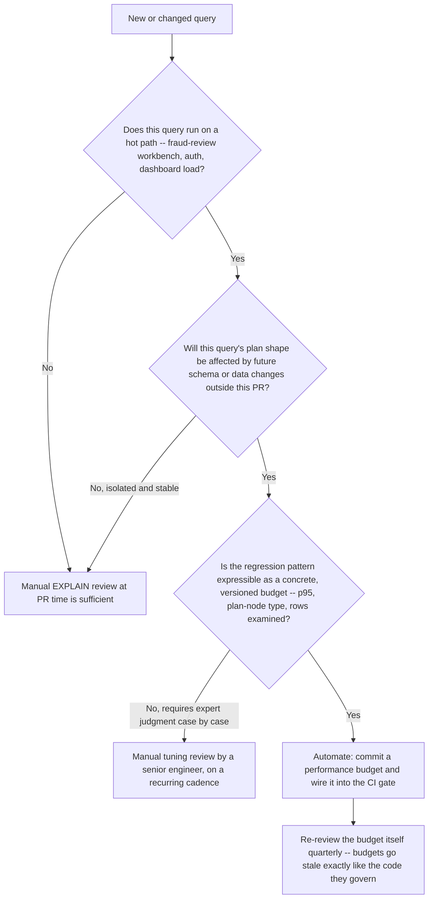

# Automated Performance Testing & CI/CD Integration

## Introduction

Every optimization technique in Lessons 01–09 and every cost technique in
Lesson 10 shares the same failure mode: it works the day it's written and
silently regresses six months later when the data volume triples, an index
gets dropped in a migration, or a well-intentioned refactor reintroduces a
non-SARGable predicate. Manual `EXPLAIN` review at PR time catches the
obvious cases. It does not catch a regression introduced by a change to a
*different* query, a schema migration, or gradual data growth. This lesson
treats query performance as a tested, gated property of the codebase —
exactly like unit tests — instead of a one-time review artifact.

> **Schema note:** this lesson's SQL lab uses the handbook's shared
> `transactions` table (part of `00_Schema.sql`), the module's documented
> extension to the core `employes`/`departments`/`locations` schema.

## Learning Objectives

- Benchmark query and transaction throughput with `pgbench` and `sysbench`
- Define performance budgets that translate directly into a pass/fail CI gate
- Wire a regression gate into GitHub Actions and GitLab CI that blocks a PR
  before a slow query reaches production
- Monitor query latency in production as the closed loop that validates
  whether the CI gate's benchmark environment reflects reality
- Decide, with a concrete decision tree, when a regression is worth
  automating detection for versus when manual tuning judgment is still required

## Why This Exists

A query optimized in Lessons 01–09 and validated for cost in Lesson 10 is only
proven correct **at the moment it was reviewed**. Schemas migrate, indexes
get dropped by a "cleanup" PR that didn't know they mattered, ORMs
regenerate query shapes on library upgrades, and data grows. None of these
events trigger a manual `EXPLAIN` review by default. A performance test
suite wired into CI is the only mechanism that re-validates every one of
this handbook's lessons on every single change, automatically, forever.

## Business Motivation

A fraud-review workbench query is tuned, reviewed, and shipped at 45ms p95.
Eight months later, an unrelated PR adds a new nullable column to the same
table and the migration tool regenerates the table without preserving a
covering index the query depended on. Nobody reviews the workbench query —
the PR touched a different feature entirely. The regression ships, the
workbench's p95 climbs past a second, and the team learns about it from a
reviewer complaint, not a test. A performance budget wired into CI turns this into a
blocked PR with a clear failure message instead of a production incident.

## Benchmarking Tools: pgbench and sysbench

- **`pgbench`** (PostgreSQL-native): built-in TPC-B-like workload generator,
  or a custom `-f script.sql` workload for testing specific queries under
  concurrency. Reports transactions per second (TPS) and latency
  percentiles directly.
- **`sysbench`** (engine-agnostic, MySQL/MariaDB/PostgreSQL via Lua scripts):
  the standard choice when the CI pipeline needs one benchmarking tool
  across multiple database engines rather than a Postgres-only workflow.
- **Custom harnesses**: for a specific query under test (rather than a
  generic OLTP workload), a small script that runs the query N times with
  realistic parameter variation and records latency percentiles is often
  more directly actionable in a CI gate than a generic `pgbench` TPC-B run,
  because it fails on the exact query that regressed rather than an
  aggregate throughput number that requires further investigation to
  attribute.

See the accompanying `ci/run_benchmark.sh` for a runnable custom-harness
example and `ci/` for ready-to-use CI templates built around it.

## Setting Performance Budgets

A performance budget is a concrete, versioned number a query must not
exceed — the CI equivalent of the SLA thinking introduced in Lesson 10's
"Business Motivation" section:

| Budget dimension | Example threshold | Where it's enforced |
|---|---|---|
| p95 latency | ≤ 50ms for a fraud-review workbench lookup query | CI gate against a seeded benchmark dataset |
| Rows examined / EXPLAIN cost | No more than 3× the rows returned (SARGability regression proxy) | CI gate, static `EXPLAIN` parse |
| Plan shape | Must remain an index scan on `idx_transactions_emp_date`, must not regress to a sequential/full scan | CI gate, `EXPLAIN` plan-node assertion |
| Regression tolerance | Fail if p95 grows more than 20% versus the baseline committed alongside the query | CI gate, diff against a stored baseline artifact |

Budgets must be **committed alongside the query they govern**, not stored
in a separate, easily-stale spreadsheet — the same principle Lesson 02
applies to keeping `EXPLAIN` review close to the code it evaluates.

## GitHub Actions and GitLab CI: Blocking a PR on Regression

Both templates in `ci/` follow the same three-stage shape:

1. **Seed** a reproducible benchmark dataset (fixed row counts and value
   distributions — a benchmark against random or empty data produces
   meaningless plan shapes, per this handbook's core "measure against
   production-realistic volume" principle).
2. **Run** the query under test via `ci/run_benchmark.sh`, capturing p95
   latency and the `EXPLAIN` plan shape.
3. **Compare** against the committed baseline and fail the job — which
   blocks the PR merge on a protected branch — if the budget is exceeded.

See `ci/github-actions-perf-gate.yml` and `ci/gitlab-ci-perf-gate.yml` for
the full, ready-to-use workflow definitions, and `ci/run_benchmark.sh` for
the benchmarking script both templates invoke.

## Monitoring Query Latency in Production

A CI gate only proves a query performs acceptably against the *benchmark
environment's* data shape. Production monitoring is the feedback loop that
validates whether that benchmark environment still reflects reality:

- Track p50/p95/p99 latency per normalized query fingerprint (not per raw
  query string — literal parameter values must be stripped so the same
  logical query is tracked as one series), using `pg_stat_statements`
  (Postgres), Performance Schema digest tables (MySQL), or an APM's
  query-level tracing.
- Alert on **relative** regression (this query's own p95 doubling) rather
  than only an absolute threshold — a query that was always slow but stable
  is a known, already-prioritized problem; a query that suddenly changed
  behavior is a new regression that CI's benchmark data missed.
- Feed confirmed production regressions back into the CI benchmark dataset:
  if production data skew caused a regression the CI gate didn't catch, the
  CI seed data was not representative — fix the seed data, not just the query.

## Decision Tree: When to Automate vs. Manual Tuning

The decision that matters most is the third diamond: automation only pays
off when the regression pattern can be expressed as a number or a plan-node
assertion a CI job can evaluate without human interpretation. A query whose
correct plan depends on judgment calls this handbook covers narratively
(Lesson 07's tuning workflow) is a poor candidate for a rigid
CI gate and a good candidate for a recurring manual review cadence instead.

## Engineering Notes

- CI benchmark environments are almost always smaller than production. A
  budget tuned against a 10,000-row seed table will not catch a regression
  that only manifests at 10 million rows. Size seed data to the smallest
  volume that still reproduces the production plan shape, not to whatever
  is fastest to load in CI.
- A flaky performance gate (one that fails intermittently on noisy CI
  runners) trains engineers to re-run the job until it passes rather than
  investigate — which defeats the entire point. Budget thresholds need
  enough margin above expected CI-runner noise to be reliable, or the gate
  should compare plan shape (deterministic) rather than raw latency
  (noisy) wherever possible.
- A regression gate on `EXPLAIN` plan shape (Lesson 02) is
  usually more reliable in CI than a regression gate on raw latency,
  because plan shape doesn't vary with shared-runner CPU contention the way
  wall-clock time does.

## MySQL / PostgreSQL / SQL Server Notes

- **PostgreSQL**: `pgbench -f custom_script.sql -T 60 -c 10` gives
  throughput and latency percentiles directly; `EXPLAIN (FORMAT JSON)`
  output can be parsed programmatically in CI to assert plan-node type
  without a human reading the plan.
- **MySQL/MariaDB**: `sysbench` with a custom Lua script is the standard
  benchmarking path; `EXPLAIN FORMAT=JSON` provides the same
  programmatically-parseable plan structure as Postgres's JSON format.
- **SQL Server**: `SET STATISTICS TIME, IO ON` combined with Extended
  Events session capture gives CI-parseable timing and I/O counters;
  `sqlpackage`/`tSQLt` are common CI-integration points for teams already
  standardized on SQL Server tooling.

## Common Mistakes

- Benchmarking against an empty or tiny seed table, producing plan shapes
  that never occur in production (Lesson 06's core anti-pattern,
  applied to test data instead of production data)
- Setting a performance budget once at launch and never revisiting it as
  the query's real-world data volume grows
- Gating on raw latency alone in a noisy, shared CI runner environment,
  producing enough false failures that engineers stop trusting — and start
  bypassing — the gate
- Testing the query in isolation without the concurrency level it actually
  experiences in production; a query that's fast single-threaded can still
  regress badly under realistic lock contention

## Anti-patterns

- A performance gate with no owner and no quarterly review, which silently
  becomes stale as the underlying data volume grows past what the budget
  was calibrated for
- Blocking every PR on a full benchmark suite run regardless of whether the
  PR touched any query-relevant code, which trains engineers to see the
  gate as noise rather than signal
- A CI gate that only checks whether the query runs without erroring,
  mistaking functional correctness for performance validation

## Edge Cases

- **Legitimate plan changes across engine versions**: a Postgres major
  version upgrade can change the optimizer's default plan choice for an
  existing query even with no code change — a CI gate needs a documented
  process for updating the baseline deliberately, distinct from a silent
  regression.
- **Seasonal or bursty data skew**: a query benchmarked against
  evenly-distributed seed data can behave very differently against
  production's actual skew (Lesson 07's discussion of
  statistics and skew) — CI seed data should mirror the production
  distribution's skew, not just its row count.

## Troubleshooting Guidance

- CI gate fails intermittently with no code change → check for shared
  CI-runner resource contention before assuming a real regression; compare
  plan shape (should be stable) against raw latency (may be noisy) to
  disambiguate.
- CI gate passes but production regresses anyway → the benchmark seed data
  almost certainly does not reflect production's actual row count, value
  distribution, or concurrency level; treat this as a seed-data bug, not a
  gate-logic bug.

## Scalability Considerations

A performance test suite has to scale in two dimensions simultaneously:
the number of queries under test grows with the codebase, and the seed
data volume for each query needs periodic recalibration as production data
grows. Budget CI runtime accordingly — running every performance test
against full production-scale seed data on every PR is rarely affordable;
a common pattern is a fast subset on every PR and a full-scale nightly run
that reports regressions without blocking merges.

## Additional Dialect Notes (Oracle, SQLite, DuckDB)

- **Oracle**: `SQL Performance Analyzer` and `SQL Plan Baselines` provide
  native regression-detection tooling that maps closely to this lesson's
  "commit a plan-shape baseline" pattern, built directly into the engine
  rather than requiring an external CI harness.
- **SQLite**: as an embedded engine with no server-side concurrency model,
  CI performance testing is usually scoped to single-query latency against
  a seeded `.db` file fixture rather than throughput/concurrency
  benchmarking — `sysbench`/`pgbench`-style tools don't apply.
- **DuckDB**: benchmarking an embedded analytical engine in CI typically
  means timing a script of representative analytical queries against a
  fixed-size Parquet/CSV fixture, since DuckDB has no persistent server
  process to run a concurrency-based benchmark against.

## Interview Questions

- "How would you design a CI gate that blocks a PR on query performance
  regression without producing so many false positives that engineers
  start ignoring it?"
- "Why is asserting on `EXPLAIN` plan shape often more reliable in CI than
  asserting on raw query latency?"
- "Walk me through your decision process for when a performance regression
  needs an automated gate versus a manual review process."

## Summary

A performance budget committed alongside the query it governs, enforced by
a CI gate that fails the build on regression, closes the gap every other
lesson in this handbook leaves open: proving a query is fast *today* says
nothing about whether it will still be fast after the next schema
migration, data-growth cycle, or unrelated refactor. Automate what can be
expressed as a concrete, versioned threshold; reserve manual tuning
judgment for regressions that genuinely require expert interpretation.

## Practice Challenges

1. Using `ci/run_benchmark.sh` as a starting point, add a plan-shape
   assertion (not just a latency threshold) for one of the queries in
   Lesson 04's join examples.
2. Walk the decision tree above for a full-text search query on a
   `products` table. Justify each branch you take.

## Further Reading

- PostgreSQL Documentation — `pgbench`
- `sysbench` official documentation and Lua scripting reference
- GitHub Actions and GitLab CI documentation — job status and merge-gate
  configuration
- Oracle Documentation — SQL Plan Management and SQL Performance Analyzer
