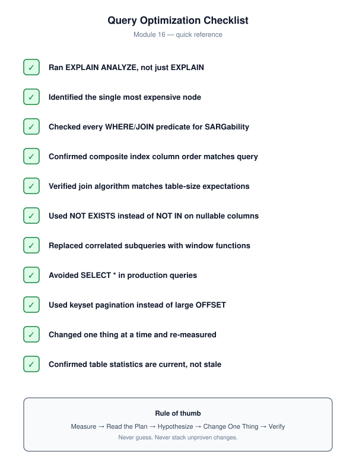
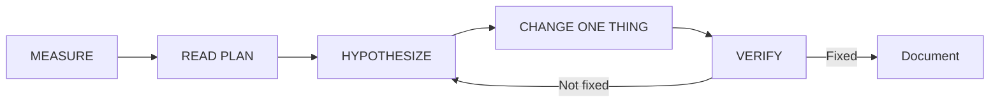

# Query Optimization Cheatsheet

> **Module 16 · Query Optimization · Reference Library**
> [Home](./README.md) · [Engineering Guide](./ENGINEERING_GUIDE.md) · [Troubleshooting](./TROUBLESHOOTING_GUIDE.md) · [Full Lessons](./README.md#complete-topic-index)

One-page reference for production query tuning. For depth, follow the linked lessons.





---

## EXPLAIN Quick Reference

| Command | Engine | What It Shows |
|---|---|---|
| `EXPLAIN (ANALYZE, BUFFERS)` | PostgreSQL | Actual plan + timing + I/O |
| `EXPLAIN ANALYZE` | MySQL 8.0.18+ | Actual plan + timing |
| Actual Execution Plan | SQL Server | Actual plan + I/O stats |
| `DBMS_XPLAN.DISPLAY_CURSOR` | Oracle | Plan for last executed statement |

**Read plans bottom-up.** The lowest/most-nested node runs first.

---

## SARGability Rules

| Non-SARGable | SARGable |
|---|---|
| `WHERE YEAR(col) = 2023` | `WHERE col >= '2023-01-01' AND col < '2024-01-01'` |
| `WHERE UPPER(col) = 'X'` | `WHERE col = 'x'` (CI collation) |
| `WHERE col LIKE '%text'` | `WHERE col LIKE 'text%'` |
| `WHERE col + 0 = 5` | `WHERE col = 5` |
| `WHERE int_col = '4'` | `WHERE int_col = 4` |

**Rule**: indexed column must appear **bare** on one side of the comparison.

---

## Composite Index Column Order

```text
(equality_col, range_col, ORDER BY col)
```

- Leading column: most selective equality filter
- Trailing column: range filter or ORDER BY
- Leftmost prefix rule: index on `(a, b)` cannot serve `WHERE b = ?` alone

---

## Join Algorithm Selection

| Algorithm | When Chosen | Requirement |
|---|---|---|
| Nested Loop | Small outer + indexed inner | Index on inner join column |
| Hash Join | Two large tables, no useful sort | Build side fits in memory |
| Merge Join | Both sides sorted on join key | Index or pre-sorted input |

---

## Top 10 Rewrites

| From | To | Why |
|---|---|---|
| `NOT IN (subquery)` | `NOT EXISTS` | NULL-safe |
| `IN (subquery)` for existence | `EXISTS` | Short-circuits |
| Correlated subquery (rank) | Window function | Single pass |
| `SELECT *` | Explicit columns | Covering index + network |
| `OFFSET n` pagination | Keyset pagination | Flat cost |
| `OR col_a OR col_b` | `UNION ALL` | Independent indexes |
| `DISTINCT` after join | `EXISTS` | No dedup step |
| Function on column | Bare column range | SARGable |
| Comma join | Explicit `JOIN ON` | Prevents cartesian |
| Nested views | Base table query | Predicate pushdown |

---

## Plan Symptom → Fix

| Plan Node | Fix |
|---|---|
| `Seq Scan` on large filtered table | Index or SARGable rewrite |
| Est >> actual rows | `ANALYZE` / refresh statistics |
| `Nested Loop`, no inner index | Index on join column |
| `Hash Join`, Batches > 1 | Increase `work_mem` or filter earlier |
| `Sort` before `LIMIT` | Index matching ORDER BY |
| `SubPlan`, loops > 1 | Rewrite to JOIN/window function |

---

## Anti-Pattern Quick List

1. `SELECT *`
2. Function on indexed column in WHERE
3. Leading wildcard LIKE
4. `NOT IN` with nullable column
5. Missing join condition
6. N+1 queries in application
7. Over-indexing
8. OR across unrelated columns
9. Large OFFSET pagination
10. Unnecessary DISTINCT

---

## Statistics Commands

```sql
-- PostgreSQL
ANALYZE table_name;

-- MySQL
ANALYZE TABLE table_name;

-- SQL Server
UPDATE STATISTICS table_name;

-- Oracle
EXEC DBMS_STATS.GATHER_TABLE_STATS('SCHEMA', 'TABLE_NAME');
```

---

## Monitoring Commands

```sql
-- PostgreSQL: top queries by total time
SELECT query, calls, mean_exec_time, total_exec_time
FROM pg_stat_statements ORDER BY total_exec_time DESC LIMIT 10;

-- PostgreSQL: current activity
SELECT pid, query, state, wait_event_type
FROM pg_stat_activity WHERE state != 'idle';
```

---

## Related Documents

- [ENGINEERING_GUIDE.md](./ENGINEERING_GUIDE.md) — full module architecture
- [REWRITE_COOKBOOK.md](./REWRITE_COOKBOOK.md) — detailed rewrites
- [PERFORMANCE_SMELLS.md](./PERFORMANCE_SMELLS.md) — 55 code smells
- [TROUBLESHOOTING_GUIDE.md](./TROUBLESHOOTING_GUIDE.md) — incident flowchart
- [07 — Query Tuning Workflow](./07_QUERY_TUNING_WORKFLOW.md) — the five-step process

[← Back to Module Home](./README.md)
