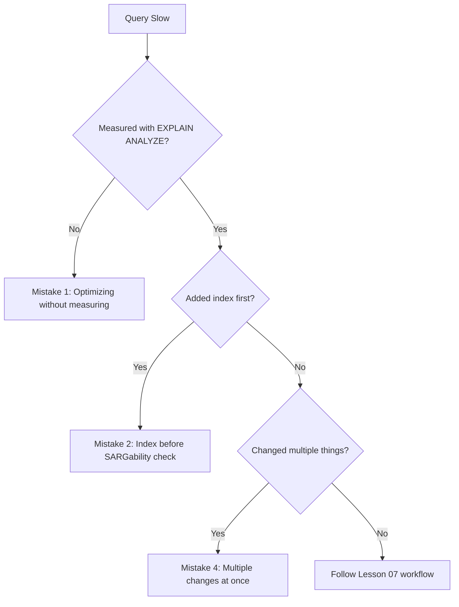

# Common Mistakes — Query Optimization

> **Module 16 · Query Optimization · Reference Library**
> [Home](./README.md) · [Best Practices](./BEST_PRACTICES.md) · [Smells](./PERFORMANCE_SMELLS.md) · [Anti-Patterns Lesson](./06_COMMON_PERFORMANCE_ANTI_PATTERNS.md)

The most frequently encountered mistakes by engineers learning or applying query optimization. Each includes the mistake, why it happens, and the correct approach.

---

## Mistake 1: Optimizing Without Measuring

**What happens**: Engineer rewrites a query or adds an index based on intuition, without running EXPLAIN ANALYZE first.

**Why it happens**: "This looks like it should be slow" is faster than measuring.

**Correct approach**: Always run EXPLAIN ANALYZE before any change. Identify the most expensive node. Form one hypothesis. → [Lesson 07](./07_QUERY_TUNING_WORKFLOW.md)

---

## Mistake 2: Adding an Index as the First Response

**What happens**: Every slow query gets an index, leading to 40+ indexes on a table, slower writes, and queries that are still slow because the predicate was non-SARGable.

**Why it happens**: "Add an index" is the most well-known optimization advice.

**Correct approach**: Check SARGability first. Verify the index would actually be chosen. Audit existing indexes before adding. → [Lesson 03](./03_SARGABILITY_AND_INDEX_USAGE.md)

---

## Mistake 3: Trusting EXPLAIN Estimates on Slow Queries

**What happens**: Engineer runs EXPLAIN (not ANALYZE), sees reasonable cost estimates, concludes the plan is fine.

**Why it happens**: EXPLAIN is faster and doesn't execute the query.

**Correct approach**: Use EXPLAIN ANALYZE for any query that's already slow. Compare estimated vs. actual rows. → [Lesson 02](./02_EXPLAIN_AND_EXECUTION_PLANS.md)

---

## Mistake 4: Changing Multiple Things at Once

**What happens**: Engineer adds an index, rewrites a subquery, and refreshes statistics in one commit. Query gets faster, but nobody knows which change helped.

**Why it happens**: Impatience; desire to "fix it all at once."

**Correct approach**: One change → measure → verify → next change. → [Lesson 07](./07_QUERY_TUNING_WORKFLOW.md)

---

## Mistake 5: Assuming SQL Executes Top-to-Bottom

**What happens**: Engineer manually reorders clauses or pre-filters in subqueries, believing this changes execution order.

**Why it happens**: SQL *looks* like it executes sequentially.

**Correct approach**: The optimizer reorders freely. Write clear, logical SQL; let the optimizer choose physical order. → [Lesson 01](./01_QUERY_EXECUTION_LIFECYCLE.md)

---

## Mistake 6: Using NOT IN with Nullable Columns

**What happens**: Query silently returns zero rows when NULL appears in the subquery column.

**Why it happens**: NOT IN works correctly in test data without NULLs; breaks in production.

**Correct approach**: Always use NOT EXISTS. → [Lesson 05](./05_SUBQUERY_AND_CTE_OPTIMIZATION.md)

---

## Mistake 7: Testing Performance on Sample Data

**What happens**: Query runs fast on 50-row dev dataset; ships to production with 5M rows and times out.

**Why it happens**: Dev environments use small sample data; setting up production-scale test data is effort.

**Correct approach**: Reason about plans at production scale. Test against the largest dataset available. "Fast in dev" ≠ "fast in production." → [Lesson 06](./06_COMMON_PERFORMANCE_ANTI_PATTERNS.md)

---

## Mistake 8: Using OFFSET for Deep Pagination

**What happens**: Page 1 is fast; page 500 takes 30 seconds. Users report "pagination is broken."

**Why it happens**: OFFSET works fine for page 1 in development; problem only appears at scale.

**Correct approach**: Keyset/cursor pagination from the start. → [Lesson 06](./06_COMMON_PERFORMANCE_ANTI_PATTERNS.md)

---

## Mistake 9: Assuming CTEs Are Materialized

**What happens**: Engineer writes an expensive CTE expecting it to compute once; PostgreSQL 12+ inlines it and recomputes per reference.

**Why it happens**: CTEs *feel* like temporary tables; pre-PG-12 behavior was always materialized.

**Correct approach**: Verify CTE behavior with EXPLAIN for your engine/version. Use MATERIALIZED keyword if needed. → [Lesson 05](./05_SUBQUERY_AND_CTE_OPTIMIZATION.md)

---

## Mistake 10: Ignoring Write Impact of Indexes

**What happens**: Team adds indexes aggressively for read performance; INSERT/UPDATE throughput degrades; index bloat accumulates.

**Why it happens**: Read optimization is visible (users complain); write degradation is gradual.

**Correct approach**: Every index is a read/write tradeoff. Audit index usage before adding. Remove unused indexes. → [Lesson 03](./03_SARGABILITY_AND_INDEX_USAGE.md)

---

## Mistake 11: Blaming the Application for Database Slowness

**What happens**: DBA blames application; application team blames database. Actual cause: N+1 query pattern in application code.

**Why it happens**: Siloed teams; slow query logs show many small queries, not one big one.

**Correct approach**: Check APM/logs for repeated near-identical queries in tight loops. → [Lesson 06](./06_COMMON_PERFORMANCE_ANTI_PATTERNS.md)

---

## Mistake 12: Not Refreshing Statistics After Bulk Operations

**What happens**: Bulk import of 2B rows; queries slow down 20×; no code changed.

**Why it happens**: Statistics refresh isn't part of the ingestion pipeline.

**Correct approach**: Always ANALYZE after bulk loads. Automate in ingestion pipeline. → [Lesson 01](./01_QUERY_EXECUTION_LIFECYCLE.md)

---

## Related Documents

- [PERFORMANCE_SMELLS.md](./PERFORMANCE_SMELLS.md) — 55 code smells
- [BEST_PRACTICES.md](./BEST_PRACTICES.md) — engineering standards
- [06 — Anti-Patterns](./06_COMMON_PERFORMANCE_ANTI_PATTERNS.md) — detailed lesson
- [07 — Query Tuning Workflow](./07_QUERY_TUNING_WORKFLOW.md) — correct process

[← Back to Module Home](./README.md)
