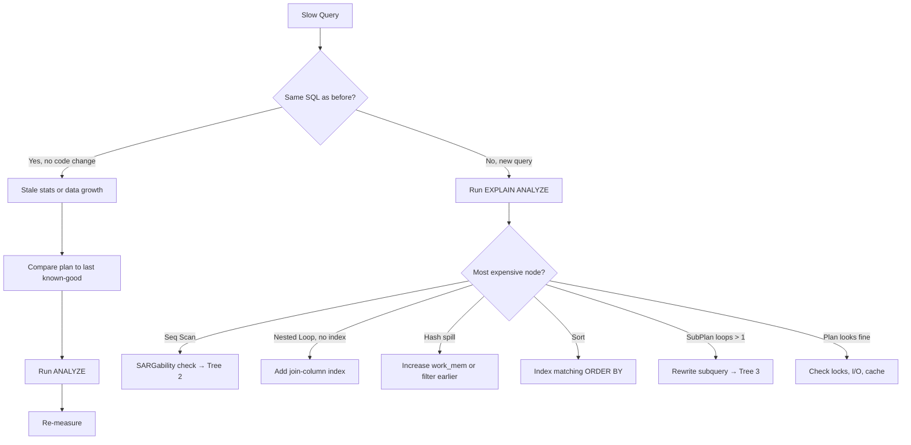
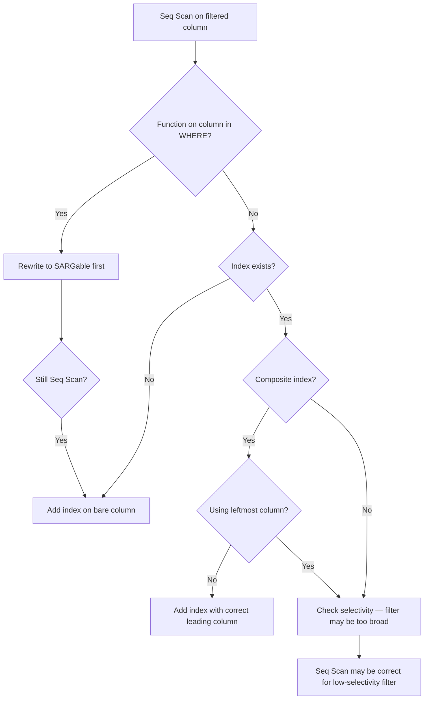
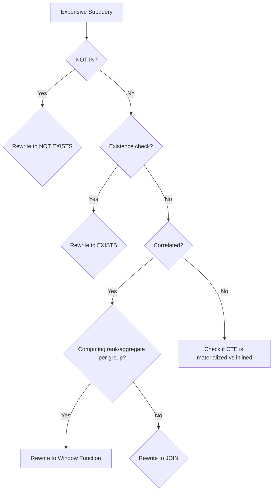
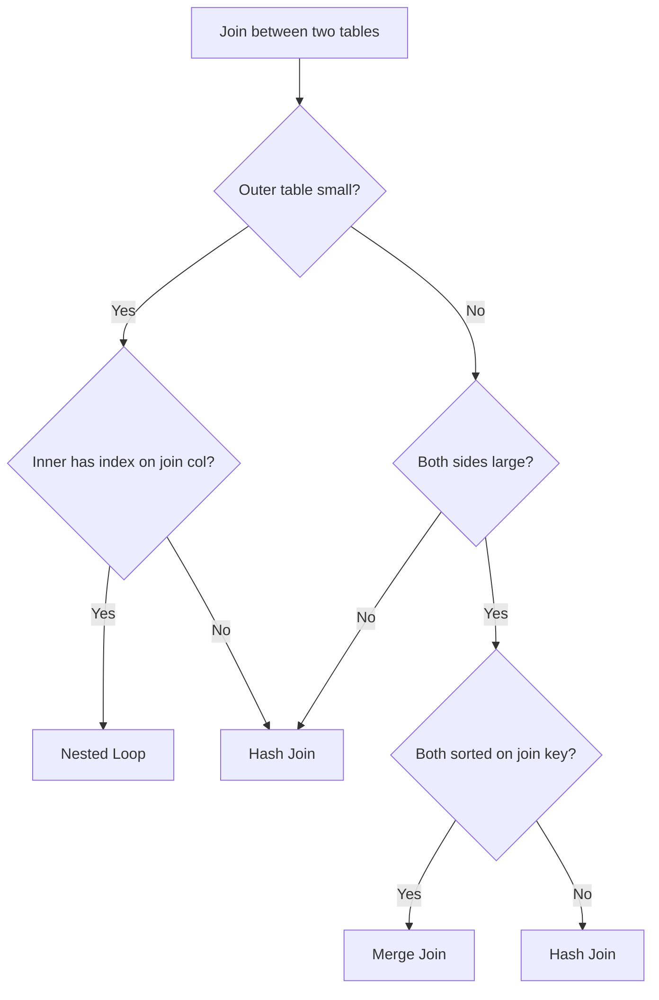
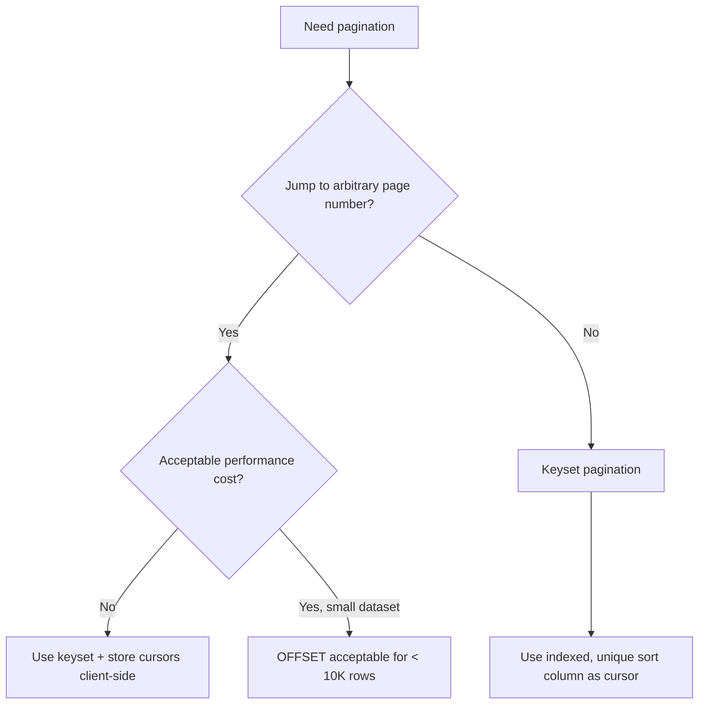
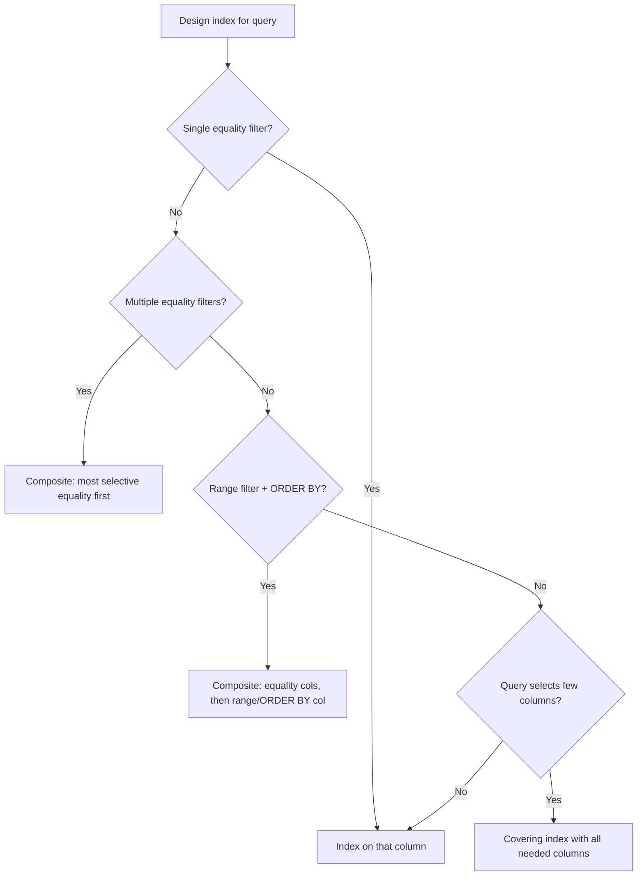

# Decision Trees — Query Optimization

> **Module 16 · Query Optimization · Reference Library**
> [Home](./README.md) · [Troubleshooting](./TROUBLESHOOTING_GUIDE.md) · [Playbook](./OPTIMIZATION_PLAYBOOK.md) · [Rewrite Cookbook](./REWRITE_COOKBOOK.md)

Visual decision guides for common tuning and rewrite choices. Use alongside [TROUBLESHOOTING_GUIDE.md](./TROUBLESHOOTING_GUIDE.md) during active incidents.

---

## Tree 1: Slow Query — Where to Start?

---

## Tree 2: Should I Add an Index or Rewrite the Query?

---

## Tree 3: Subquery Rewrite Decision

---

## Tree 4: Join Algorithm Prediction

---

## Tree 5: Pagination Strategy

---

## Tree 6: Index Design

---

## Related Documents

- [REWRITE_COOKBOOK.md](./REWRITE_COOKBOOK.md)
- [OPTIMIZATION_PLAYBOOK.md](./OPTIMIZATION_PLAYBOOK.md)
- [TROUBLESHOOTING_GUIDE.md](./TROUBLESHOOTING_GUIDE.md)
- [CHEATSHEET.md](./CHEATSHEET.md)

[← Back to Module Home](./README.md)
