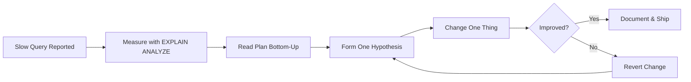

# Query Optimization Engineering Guide

> **Module 16 · Query Optimization · Reference Library**
> [Home](./README.md) · [Lessons](./README.md#complete-topic-index) · [Performance Lab](./performance_lab/README.md) · [Cheatsheet](./CHEATSHEET.md) · [Troubleshooting](./TROUBLESHOOTING_GUIDE.md)

This document is the **architectural spine** of Module 16. Read it once before diving into individual lessons; return to it when you need to orient a team, onboard a new engineer, or decide which lesson applies to a production incident.


---

## What This Module Teaches

Query optimization is the discipline of making SQL **fast, predictable, and explainable** at production scale. It is not about memorizing syntax tricks — it is about understanding how a cost-based optimizer (CBO) transforms logical SQL into a physical execution plan, and how to influence that transformation without fighting the engine.

Every lesson in this module maps to one stage of that mental model:

| Stage | Lesson | Core Question |
|---|---|---|
| Lifecycle | [01 — Query Execution Lifecycle](./01_QUERY_EXECUTION_LIFECYCLE.md) | What happens between "Run" and rows returned? |
| Diagnosis | [02 — EXPLAIN & Execution Plans](./02_EXPLAIN_AND_EXECUTION_PLANS.md) | How do I see what the engine actually did? |
| Indexing | [03 — SARGability & Index Usage](./03_SARGABILITY_AND_INDEX_USAGE.md) | Why does my index exist but never get used? |
| Joins | [04 — Join Optimization](./04_JOIN_OPTIMIZATION.md) | How does the optimizer choose nested loop vs. hash vs. merge? |
| Rewrites | [05 — Subquery & CTE Optimization](./05_SUBQUERY_AND_CTE_OPTIMIZATION.md) | When does EXISTS beat IN, and when does a CTE hurt? |
| Prevention | [06 — Anti-Patterns](./06_COMMON_PERFORMANCE_ANTI_PATTERNS.md) | What recurring mistakes wreck production performance? |
| Process | [07 — Query Tuning Workflow](./07_QUERY_TUNING_WORKFLOW.md) | How do I tune systematically instead of guessing? |

---

## The Engineering Mindset



Three principles govern every decision in this module:

1. **Measure before you change.** `EXPLAIN ANALYZE` is the only evidence that counts. Intuition about "this should be faster" is how databases accumulate 40 redundant indexes and queries that are still slow.

2. **Change one thing at a time.** If you add an index *and* rewrite a subquery *and* refresh statistics in the same commit, you cannot attribute the result — and you cannot build a reliable mental model for the next incident.

3. **The optimizer is usually right.** When a query scans a table sequentially on a 50-row dev dataset, the optimizer is correct — a sequential scan *is* cheaper than an index lookup at that scale. Performance problems appear when data volume crosses thresholds the optimizer's statistics describe accurately.

---

## Production Architecture Context

```text
┌─────────────────────────────────────────────────────────────────┐
│                        Application Layer                         │
│   ORM / BI Tool / Dashboard / Batch Job / API Endpoint          │
└────────────────────────────┬────────────────────────────────────┘
                             │ SQL text + bind parameters
                             ▼
┌─────────────────────────────────────────────────────────────────┐
│                     Connection Pool / Proxy                        │
│   PgBouncer · RDS Proxy · SQL Server Connection Pooler          │
└────────────────────────────┬────────────────────────────────────┘
                             │
                             ▼
┌─────────────────────────────────────────────────────────────────┐
│                    Query Processing Pipeline                     │
│  ┌─────────┐  ┌─────────┐  ┌──────────────┐  ┌───────────┐     │
│  │ Parsing │→ │ Binding │→ │ Optimization │→ │ Execution │     │
│  └─────────┘  └─────────┘  └──────────────┘  └───────────┘     │
│                                    ↑                             │
│                          Statistics / Catalog                    │
│                          Index Metadata / Hints                  │
└────────────────────────────┬────────────────────────────────────┘
                             │
                             ▼
┌─────────────────────────────────────────────────────────────────┐
│                      Storage Engine                              │
│   B-tree Indexes · Heap/Clustered Pages · Buffer Pool / Cache   │
└─────────────────────────────────────────────────────────────────┘
```

Your SQL text enters at the top. The **Optimization** stage (Lesson 01) is where every technique in this module operates. The **Storage Engine** is where indexes (Lesson 03) and join algorithms (Lesson 04) actually execute.

---

## When to Use Which Reference Document

| Situation | Document |
|---|---|
| Active slow-query incident | [TROUBLESHOOTING_GUIDE.md](./TROUBLESHOOTING_GUIDE.md) |
| Pre-release PR review | [PERFORMANCE_CHECKLIST.md](./PERFORMANCE_CHECKLIST.md) |
| Rewriting a known-bad pattern | [REWRITE_COOKBOOK.md](./REWRITE_COOKBOOK.md) |
| Spotting code smells in review | [PERFORMANCE_SMELLS.md](./PERFORMANCE_SMELLS.md) |
| Learning from real outages | [PRODUCTION_INCIDENTS.md](./PRODUCTION_INCIDENTS.md) |
| Cross-engine behavior differences | [CROSS_DATABASE_ENGINEERING.md](./CROSS_DATABASE_ENGINEERING.md) |
| Quick lookup during tuning | [CHEATSHEET.md](./CHEATSHEET.md) |
| Benchmarking a rewrite | [BENCHMARK_GUIDE.md](./BENCHMARK_GUIDE.md) + [performance_lab/](./performance_lab/) |
| Onboarding a new contributor | [CONTRIBUTOR_ENGINEERING_NOTES.md](./CONTRIBUTOR_ENGINEERING_NOTES.md) |

---

## Assumed Production Scale

This module uses the handbook's shared `employes` / `departments` / `locations` schema ([`00_Schema`](../00_Schema)). Every performance claim assumes the following production volumes unless stated otherwise:

| Table | Production Rows | Why It Matters |
|---|---|---|
| `employes` | 5–50 million | Primary fact table; index and join decisions visible here |
| `departments` | 40–500 | Small dimension; predicate pushdown shrinks join input |
| `locations` | 12–200 | Tiny lookup; often fully cached in memory |

At local sample sizes (dozens of rows), the optimizer correctly ignores indexes and chooses sequential scans. **Always reason about plans at production scale**, then verify with `EXPLAIN` against the largest dataset available.

---

## Version Compatibility

| Engine | Minimum Version for Module Examples | Notes |
|---|---|---|
| PostgreSQL | 12+ | CTE inlining default changed in PG 12 |
| MySQL | 8.0.18+ | `EXPLAIN ANALYZE` and hash joins require 8.0.18+ |
| SQL Server | 2017+ | Query Store available; graph plans in SSMS |
| Oracle | 19c+ | `DBMS_XPLAN.DISPLAY_CURSOR` for actual plans |
| SQLite | 3.35+ | Limited optimizer; nested loop only |
| DuckDB | 0.9+ | Vectorized execution; different cost model |

See [CROSS_DATABASE_ENGINEERING.md](./CROSS_DATABASE_ENGINEERING.md) for per-engine optimizer, statistics, and hint differences.

---

## Related Handbook Modules

- [`03_Joins`](../03_Joins) — join syntax this module optimizes
- [`04_Subqueries`](../04_Subqueries) — subquery patterns rewritten in Lesson 05
- [`06_CTEs`](../06_CTEs) — CTE materialization behavior in Lesson 05
- [`07_Window_Functions`](../07_Window_Functions) — preferred rewrite for correlated subqueries
- [`15_INDEXES`](../15_INDEXES) — dedicated indexes module (planned; Lesson 03 covers essentials)

---

## Continue Learning

After completing this module's seven lessons and practice problems:

1. Work through the [performance_lab/](./performance_lab/) benchmark exercises
2. Study all entries in [REWRITE_COOKBOOK.md](./REWRITE_COOKBOOK.md)
3. Read [PRODUCTION_INCIDENTS.md](./PRODUCTION_INCIDENTS.md) and map each incident to a lesson
4. Complete the [PERFORMANCE_CHECKLIST.md](./PERFORMANCE_CHECKLIST.md) against a query from your own codebase

---

## Navigation

| Lessons | Reference | Labs & Practice |
|---|---|---|
| [01 Lifecycle](./01_QUERY_EXECUTION_LIFECYCLE.md) | [Troubleshooting](./TROUBLESHOOTING_GUIDE.md) | [Performance Lab](./performance_lab/README.md) |
| [02 EXPLAIN](./02_EXPLAIN_AND_EXECUTION_PLANS.md) | [Rewrite Cookbook](./REWRITE_COOKBOOK.md) | [Practice Problems](./PRACTICE_PROBLEMS.md) |
| [03 SARGability](./03_SARGABILITY_AND_INDEX_USAGE.md) | [Production Incidents](./PRODUCTION_INCIDENTS.md) | [SOLUTIONS.sql](./SOLUTIONS.sql) |
| [04 Joins](./04_JOIN_OPTIMIZATION.md) | [Decision Trees](./DECISION_TREE.md) | [Benchmark Guide](./BENCHMARK_GUIDE.md) |
| [05 Subqueries](./05_SUBQUERY_AND_CTE_OPTIMIZATION.md) | [Performance Smells](./PERFORMANCE_SMELLS.md) | |
| [06 Anti-Patterns](./06_COMMON_PERFORMANCE_ANTI_PATTERNS.md) | [Cross-DB Guide](./CROSS_DATABASE_ENGINEERING.md) | |
| [07 Workflow](./07_QUERY_TUNING_WORKFLOW.md) | [Glossary](./ENGINEERING_GLOSSARY.md) | |

[← Back to Module Home](./README.md)
