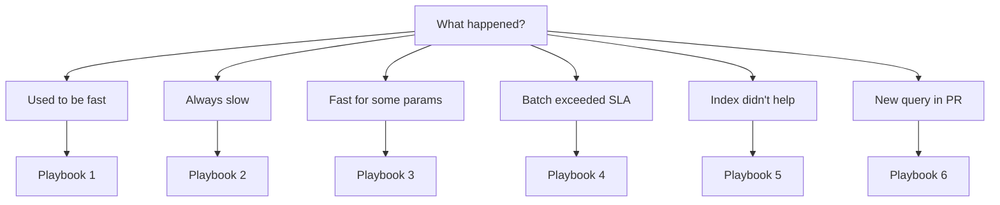

# Optimization Playbook

> **Module 16 · Query Optimization · Reference Library**
> [Home](./README.md) · [Troubleshooting](./TROUBLESHOOTING_GUIDE.md) · [Decision Trees](./DECISION_TREE.md) · [Lesson 07](./07_QUERY_TUNING_WORKFLOW.md)

Structured tuning sequences for common production scenarios. Follow the playbook that matches your situation; each step links to the relevant lesson.

---

## Playbook 1: "Query Used to Be Fast, Now It's Slow"

**Trigger**: Same SQL, no code changes, runtime increased.

| Step | Action | Lesson |
|---|---|---|
| 1 | Run `EXPLAIN ANALYZE`, record actual time | 02 |
| 2 | Compare current plan to last known-good plan (Query Store / saved plan) | 02 |
| 3 | Check estimated vs. actual row counts on expensive node | 02 |
| 4 | If gap > 10×: run `ANALYZE` / `UPDATE STATISTICS` | 01 |
| 5 | Check for recent bulk load, DELETE, or schema change | 01 |
| 6 | If plan shape changed: investigate data volume growth | 04 |
| 7 | Re-measure after statistics refresh | 07 |

---

## Playbook 2: "Query Is Slow on First Run"

**Trigger**: New query or query never optimized; consistently slow.

| Step | Action | Lesson |
|---|---|---|
| 1 | Run `EXPLAIN ANALYZE`, identify most expensive node | 02 |
| 2 | If Seq Scan on filtered column: check SARGability | 03 |
| 3 | If non-SARGable: rewrite predicate | 03, REWRITE_COOKBOOK |
| 4 | If SARGable but no index: design and create index | 03 |
| 5 | If Nested Loop without inner index: index join column | 04 |
| 6 | If SubPlan with loops > 1: rewrite subquery | 05 |
| 7 | If Sort before LIMIT: add index matching ORDER BY | 03, 06 |
| 8 | Re-measure; repeat from step 2 if still slow | 07 |

---

## Playbook 3: "Query Fast for Some Parameters, Slow for Others"

**Trigger**: Intermittent slowness; parameter-dependent performance.

| Step | Action | Lesson |
|---|---|---|
| 1 | Run `EXPLAIN ANALYZE` with the slow parameter value | 02 |
| 2 | Run `EXPLAIN ANALYZE` with the fast parameter value | 02 |
| 3 | Compare plans — different plan shapes = parameter sniffing | 01 |
| 4 | Check plan cache for cached plan optimized for atypical value | 01 |
| 5 | Fix: `OPTION (RECOMPILE)` (SQL Server) or plan guide | 01 |
| 6 | Alternative: optimize for typical parameter distribution | 01 |
| 7 | Long-term: consider separate queries for skewed vs. normal cases | 07 |

---

## Playbook 4: "Batch Job Exceeded SLA"

**Trigger**: Scheduled query/batch job runtime exceeds window.

| Step | Action | Lesson |
|---|---|---|
| 1 | Run `EXPLAIN ANALYZE` on batch query against production-scale data | 02 |
| 2 | Check for Seq Scan on largest table in the plan | 02, 03 |
| 3 | Check for correlated subquery (SubPlan loops > outer rows) | 05 |
| 4 | Check for unnecessary DISTINCT or Sort steps | 06 |
| 5 | Apply targeted rewrite or index (one change) | REWRITE_COOKBOOK |
| 6 | Consider parallel query if engine supports it | CROSS_DATABASE |
| 7 | Consider partitioning if query scans historical data unnecessarily | CROSS_DATABASE |
| 8 | Re-measure full batch runtime, not just query time | 07 |

---

## Playbook 5: "New Index Didn't Help"

**Trigger**: Index created but query still slow or plan unchanged.

| Step | Action | Lesson |
|---|---|---|
| 1 | Verify index exists: check catalog / `\d table` / `SHOW INDEX` | 03 |
| 2 | Check EXPLAIN — is the index actually chosen? | 02 |
| 3 | If not chosen: check SARGability of predicate | 03 |
| 4 | If SARGable but not chosen: check selectivity (is filter too broad?) | 03 |
| 5 | If composite index: check leftmost prefix rule | 03 |
| 6 | Run `ANALYZE` — optimizer may not know index exists yet | 01 |
| 7 | If table is small: Seq Scan may genuinely be cheaper — verify at production scale | 02 |

---

## Playbook 6: "Pre-Release Query Review"

**Trigger**: New query in PR touching production tables.

| Step | Action | Document |
|---|---|---|
| 1 | Run through [PERFORMANCE_SMELLS.md](./PERFORMANCE_SMELLS.md) catalog | Smells |
| 2 | Run through [PERFORMANCE_CHECKLIST.md](./PERFORMANCE_CHECKLIST.md) | Checklist |
| 3 | Run `EXPLAIN ANALYZE` against staging with production-scale data | 02 |
| 4 | Verify no `NOT IN` against nullable columns | 05 |
| 5 | Verify explicit column list (no SELECT *) | 06 |
| 6 | Document assumed production data volume in PR | BEST_PRACTICES |
| 7 | Approve or request changes | — |

---

## Related Documents

- [TROUBLESHOOTING_GUIDE.md](./TROUBLESHOOTING_GUIDE.md)
- [DECISION_TREE.md](./DECISION_TREE.md)
- [07 — Query Tuning Workflow](./07_QUERY_TUNING_WORKFLOW.md)
- [PERFORMANCE_CHECKLIST.md](./PERFORMANCE_CHECKLIST.md)
- [REWRITE_COOKBOOK.md](./REWRITE_COOKBOOK.md)

[← Back to Module Home](./README.md)
