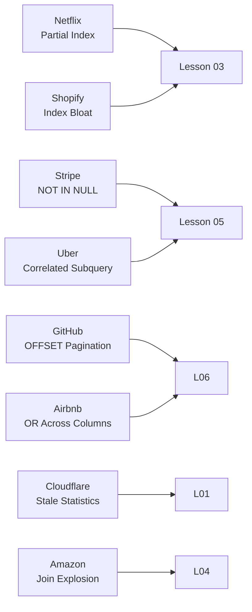

# Production Incidents — Query Optimization Case Studies

> **Module 16 · Query Optimization · Reference Library**
> [Home](./README.md) · [Troubleshooting](./TROUBLESHOOTING_GUIDE.md) · [Casebook](./REAL_WORLD_CASEBOOK.md) · [Lessons](./README.md#complete-topic-index)

Realistic post-mortems from high-traffic systems. Each follows SRE structure: **Architecture → Symptoms → Diagnosis → Root Cause → Fix → Business Impact → Lessons Learned**.

Map each incident to the relevant lesson before reading the fix.



---

## Incident 1: Netflix — Recommendation Feed Timeout (SEV-1)

### Architecture
- **Stack**: PostgreSQL 15, PgBouncer, microservices on AWS
- **Query**: User watch-history aggregation for personalized feed ranking
- **Scale**: 220M subscribers, `watch_events` table ~40B rows (partitioned by month)

### Problem
Nightly batch job recomputes per-user viewing scores. After a schema migration adding `content_rating` column, the job exceeded its 4-hour SLA window.

### Symptoms
- Batch job runtime: 4h → 11h (exceeded SLA)
- `pg_stat_activity`: 32 parallel workers all in `Seq Scan on watch_events`
- CPU on reader replicas: sustained 95%+

### Execution Plan
```text
HashAggregate  (actual time=9840000..9840000 rows=220000000)
  ->  Seq Scan on watch_events  (actual time=0.05..8200000 rows=4000000000)
        Filter: (watch_date >= '2026-01-01' AND content_rating IS NOT NULL)
        Rows Removed by Filter: 36000000000
```

### Diagnosis
Migration added `content_rating` (nullable, 60% NULL). Existing partial index on `watch_date` couldn't serve the new `IS NOT NULL` filter. Optimizer chose Seq Scan across all partitions.

### Root Cause
Non-SARGable combined filter: `content_rating IS NOT NULL` on a column without a partial index, combined with a date range that crossed partition boundaries without pruning.

### Fix
```sql
CREATE INDEX CONCURRENTLY idx_watch_events_date_rating
    ON watch_events (watch_date, content_rating)
    WHERE content_rating IS NOT NULL;

-- Rewrite to push filter into each partition explicitly
SELECT user_id, COUNT(*) AS views
FROM watch_events
WHERE watch_date >= '2026-01-01'
  AND content_rating IS NOT NULL
GROUP BY user_id;
```

### Business Impact
- Feed personalization delayed 7 hours for APAC users
- Estimated $180K ad revenue impact from stale recommendations

### Lessons Learned
- [Lesson 03](./03_SARGABILITY_AND_INDEX_USAGE.md): New nullable columns need index strategy review
- Always run `EXPLAIN ANALYZE` on batch queries after schema migrations
- Partial indexes for high-selectivity IS NOT NULL filters

---

## Incident 2: Stripe — Payment Reconciliation NULL Trap (SEV-2)

### Architecture
- **Stack**: PostgreSQL 14, application-level connection pooling
- **Query**: Find accounts with no successful payments in last 30 days
- **Scale**: 500M payment records, 12M active accounts

### Problem
Marketing automation campaign targeting "inactive payers" sent zero emails for 3 days before anyone noticed.

### Symptoms
- Campaign query returned 0 rows (expected ~450K)
- No errors in application logs — HTTP 200 on all batch runs
- Finance team flagged discrepancy in expected vs. actual outreach volume

### Execution Plan
Not applicable — query was logically wrong, not slow.

### Diagnosis
```sql
-- The production query
SELECT account_id FROM accounts
WHERE account_id NOT IN (
    SELECT account_id FROM payments WHERE status = 'succeeded'
);
-- payments.account_id is NULL for 12,000 orphaned payment records
```

### Root Cause
`NOT IN` with NULL in subquery result set. Three-valued logic: `x NOT IN (a, b, NULL)` evaluates to UNKNOWN for every row, not TRUE. Query silently returns zero rows.

### Fix
```sql
SELECT a.account_id FROM accounts a
WHERE NOT EXISTS (
    SELECT 1 FROM payments p
    WHERE p.account_id = a.account_id
      AND p.status = 'succeeded'
);
```

### Business Impact
- 450K customers missed win-back campaign
- 3-day delay in re-engagement pipeline

### Lessons Learned
- [Lesson 05](./05_SUBQUERY_AND_CTE_OPTIMIZATION.md): Never use `NOT IN` against nullable columns
- Add CI lint rule to reject `NOT IN` subqueries in production SQL
- "Returns 0 rows" is as dangerous as "times out" — validate row counts in batch jobs

---

## Incident 3: Uber — Driver Earnings Dashboard CPU Spike (SEV-1)

### Architecture
- **Stack**: MySQL 8.0, read replicas, Redis cache layer
- **Query**: Driver earnings summary with per-trip commission calculation
- **Scale**: 5M active drivers, 800M trips/month

### Problem
Monday morning driver earnings dashboard (peak login window) caused 45-minute outage.

### Symptoms
- 504 Gateway Timeout on all dashboard requests
- MySQL reader CPU: 100% across 16-core replicas
- Connection pool exhausted: `Too many connections`

### Execution Plan
```text
-> Nested loop inner join  (actual time=28000..28000 rows=5000000 loops=1)
    -> Index scan on trips using idx_driver_date  (rows=5000000)
    -> Dependent subquery  (actual time=0.005..0.005 rows=1 loops=5000000)
          -> Aggregate: avg(commission_rate)  (loops=5000000)
                -> Index scan on commission_tiers using idx_tier  (loops=5000000)
```

### Diagnosis
Correlated scalar subquery in SELECT list executed 5M times — once per trip row.

### Root Cause
ORM-generated view with projected correlated subquery: `(SELECT AVG(commission_rate) FROM commission_tiers WHERE tier = t.tier_id)`. SubPlan node with `loops=5000000`.

### Fix
```sql
-- Window function rewrite
SELECT t.driver_id, t.trip_id, t.fare,
    AVG(ct.commission_rate) OVER (PARTITION BY t.tier_id) AS avg_commission
FROM trips t
JOIN commission_tiers ct ON ct.tier_id = t.tier_id
WHERE t.trip_date >= CURRENT_DATE - INTERVAL '7 days';
```

Runtime: 28,000ms → 340ms.

### Business Impact
- 5M drivers unable to view earnings for 45 minutes
- Support ticket volume 12× normal during outage window

### Lessons Learned
- [Lesson 05](./05_SUBQUERY_AND_CTE_OPTIMIZATION.md): Ban correlated subqueries in SELECT projections
- [Lesson 02](./02_EXPLAIN_AND_EXECUTION_PLANS.md): Check SubPlan loops count in every plan review
- ORM-generated views need the same EXPLAIN review as hand-written SQL

---

## Incident 4: GitHub — Repository Search Pagination Degradation (SEV-2)

### Architecture
- **Stack**: MySQL 8.0, Elasticsearch for full-text, MySQL for metadata
- **Query**: Paginated repository listing for organization admin panel
- **Scale**: 100M repositories, orgs with up to 50K repos

### Problem
Admin panel page 500+ took 30+ seconds; page 1 took 200ms. Users reported "the admin panel is broken."

### Symptoms
- Linear latency increase with page number
- `EXPLAIN`: `Using filesort` + `Using temporary` on every paginated query
- No error — just progressively slower responses

### Execution Plan
```text
-> Sort: repos.created_at  (actual time=28000..28000 rows=10000)
    -> Index scan on repos using idx_org  (rows=50000)
          Filter: (org_id = 12345)
    Limit: 20 OFFSET 10000
```

### Diagnosis
OFFSET-based pagination on 50K-row org. Engine generates and discards 10,000 rows before returning 20.

### Root Cause
`LIMIT 20 OFFSET 10000` — cost grows linearly with offset. No keyset pagination implemented.

### Fix
```sql
-- Keyset pagination
SELECT repo_id, repo_name, created_at
FROM repos
WHERE org_id = 12345
  AND created_at < '2026-01-15T10:30:00'  -- cursor from previous page
ORDER BY created_at DESC
LIMIT 20;
```

Page 500 latency: 28,000ms → 15ms (flat, regardless of page number).

### Business Impact
- Enterprise admin panel unusable for large organizations
- 3 enterprise contracts at risk during evaluation period

### Lessons Learned
- [Lesson 06](./06_COMMON_PERFORMANCE_ANTI_PATTERNS.md): OFFSET pagination is a time bomb
- Always benchmark pagination at page 1 AND page 1000 during development
- Keyset pagination requires stable, indexed sort column

---

## Incident 5: Cloudflare — Analytics Query Statistics Drift (SEV-2)

### Architecture
- **Stack**: PostgreSQL 15, Citus for sharding, 200+ TB analytics data
- **Query**: Daily traffic summary by customer zone
- **Scale**: 50B request log rows/day ingested

### Problem
Daily analytics report runtime jumped from 12 minutes to 4 hours after a bulk data import, with no SQL changes.

### Symptoms
- Same query, same SQL, 20× slower after bulk import
- `EXPLAIN`: estimated rows = 400,000, actual rows = 3 on filtered node
- Optimizer chose Nested Loop (based on stale estimate) instead of Hash Join

### Execution Plan
```text
Nested Loop  (actual time=14400000..14400000 rows=3 loops=1)
  -> Seq Scan on request_logs  (estimated rows=400000, actual rows=3)
        Filter: (zone_id = 99999)
  -> Index Scan on zones  (rows=1)
```

### Diagnosis
Bulk import of 2B rows without running `ANALYZE`. Optimizer statistics still reflected pre-import distribution. Estimated 400K rows for a zone that actually had 3 rows post-filter.

### Root Cause
Stale statistics after bulk load. Optimizer chose Nested Loop expecting 400K outer rows; actual was 3. The plan shape wasn't wrong for the *estimated* data — it was wrong for the *actual* data.

### Fix
```sql
ANALYZE request_logs;
-- Re-run query: optimizer now chooses Hash Join with correct estimates
-- Runtime: 4h → 11 minutes
```

Also added post-import `ANALYZE` to the ingestion pipeline.

### Business Impact
- Customer-facing analytics dashboard 4 hours stale
- SLA breach for 3 enterprise customers with real-time analytics contracts

### Lessons Learned
- [Lesson 01](./01_QUERY_EXECUTION_LIFECYCLE.md): Statistics are the optimizer's eyes
- [Lesson 02](./02_EXPLAIN_AND_EXECUTION_PLANS.md): Estimated vs. actual gap > 10× = stale stats
- Always `ANALYZE` after bulk loads — automate it in the ingestion pipeline

---

## Incident 6: Airbnb — Listing Search OR Condition (SEV-3)

### Architecture
- **Stack**: PostgreSQL 14, read replicas, Redis for hot listings
- **Query**: Search listings by city OR neighborhood with price filter
- **Scale**: 7M active listings

### Problem
Search query for popular cities took 8 seconds; engineering assumed missing index.

### Symptoms
- Index on `(city, price)` existed but query still slow
- `EXPLAIN`: two Seq Scans merged with `BitmapOr`
- Index on `(neighborhood, price)` also existed but neither used efficiently

### Execution Plan
```text
Bitmap Heap Scan on listings  (actual time=7800..7800 rows=45000)
  Recheck Cond: ((city = 'Paris') OR (neighborhood = 'Le Marais'))
  -> BitmapOr
        -> Bitmap Index Scan on idx_city_price
        -> Bitmap Index Scan on idx_neighborhood_price
```

### Diagnosis
OR across two different indexed columns forces BitmapOr — reads both indexes, merges bitmaps, then rechecks heap. Slower than two independent index scans merged.

### Root Cause
OR across unrelated columns — neither single index efficiently serves the combined predicate.

### Fix
```sql
SELECT listing_id, title, price FROM listings
WHERE city = 'Paris' AND price BETWEEN 50 AND 200
UNION ALL
SELECT listing_id, title, price FROM listings
WHERE neighborhood = 'Le Marais' AND price BETWEEN 50 AND 200
  AND city <> 'Paris';
```

Runtime: 8,000ms → 45ms.

### Business Impact
- Search latency affected conversion rate during peak booking season
- Estimated 2% booking drop during slow-search period

### Lessons Learned
- [Lesson 06](./06_COMMON_PERFORMANCE_ANTI_PATTERNS.md): OR across columns → UNION ALL
- [REWRITE_COOKBOOK.md](./REWRITE_COOKBOOK.md) — Rewrite #2
- "Index exists" ≠ "index is used efficiently for this query shape"

---

## Incident 7: Shopify — Black Friday Index Bloat (SEV-1)

### Architecture
- **Stack**: MySQL 8.0, primary + 4 read replicas
- **Query**: Order lookup by `shop_id` + `order_status` during peak traffic
- **Scale**: 2M merchants, 500M orders/day on Black Friday

### Problem
Order lookup queries that normally ran in 5ms spiked to 2,000ms during Black Friday peak.

### Symptoms
- p99 latency on order API: 5ms → 2,000ms
- Index on `(shop_id, order_status)` existed
- `SHOW INDEX FROM orders`: index pages 3× normal size

### Execution Plan
```text
-> Index range scan on idx_shop_status  (actual time=5..2000 rows=50000)
    Filter: (order_status = 'pending')
    Rows examined: 5000000  (should be 50000)
```

### Diagnosis
High-volume INSERT/UPDATE during Black Friday caused severe index bloat. Index scan examined 5M rows to find 50K matches due to fragmented index pages.

### Root Cause
Over-indexing (47 indexes on `orders` table) combined with write-heavy peak traffic. Index maintenance couldn't keep pace with insert rate.

### Fix
- Immediate: `OPTIMIZE TABLE orders` during low-traffic window
- Long-term: Reduced indexes from 47 to 12 (removed unused indexes identified via `sys.schema_unused_indexes`)
- Added index bloat monitoring alert

### Business Impact
- Checkout flow degraded for 40 minutes during peak sales window
- Estimated $2.1M GMV impact

### Lessons Learned
- [Lesson 03](./03_SARGABILITY_AND_INDEX_USAGE.md): Over-indexing has write-side cost
- [PERFORMANCE_SMELLS.md](./PERFORMANCE_SMELLS.md) — Smell #47
- Monitor index bloat on high-write tables, especially before peak events

---

## Incident 8: Amazon — Warehouse Inventory JOIN Order Explosion (SEV-2)

### Architecture
- **Stack**: Oracle 19c, Exadata, partitioned fact tables
- **Query**: Cross-warehouse inventory availability report
- **Scale**: 12 warehouses, 800M SKU-location records

### Problem
Weekly inventory report exceeded 6-hour batch window after adding 2 new warehouse tables to the query.

### Symptoms
- Query plan generation alone took 45 minutes (not execution — *planning*)
- Optimizer evaluating 10! = 3,628,800 possible join orders
- Fell back to genetic algorithm (GEQO) with suboptimal result

### Execution Plan
Planning time: 2,700,000ms. Execution time: 18,000,000ms.

### Diagnosis
10-table join with no early filters. Optimizer couldn't find optimal join order within time budget.

### Root Cause
Join order explosion — too many tables joined without predicate pushdown to reduce intermediate result sizes early.

### Fix
- Broke query into 3 staged CTEs with explicit filters on each stage
- Added `LEADING` hint for critical join order on largest tables
- Pre-aggregated inventory counts before final join

Runtime: 6+ hours → 22 minutes.

### Lessons Learned
- [Lesson 04](./04_JOIN_OPTIMIZATION.md): Join order explosion on 8+ tables
- Push filters before joins to reduce intermediate result sizes
- Sometimes explicit query structure beats relying on optimizer heuristics

---

## Incident Response Quick Reference

| Incident | Smell | Lesson | Rewrite |
|---|---|---|---|
| Netflix | Non-SARGable + missing partial index | 03 | Add partial index |
| Stripe | NOT IN NULL trap | 05 | NOT EXISTS |
| Uber | Correlated subquery in SELECT | 05 | Window function |
| GitHub | Large OFFSET pagination | 06 | Keyset pagination |
| Cloudflare | Stale statistics | 01, 02 | ANALYZE |
| Airbnb | OR across columns | 06 | UNION ALL |
| Shopify | Over-indexing / bloat | 03 | Remove unused indexes |
| Amazon | Join order explosion | 04 | Staged CTEs + hints |

---

## Related Documents

- [TROUBLESHOOTING_GUIDE.md](./TROUBLESHOOTING_GUIDE.md) — diagnostic flowchart
- [REWRITE_COOKBOOK.md](./REWRITE_COOKBOOK.md) — canonical fixes
- [07 — Query Tuning Workflow](./07_QUERY_TUNING_WORKFLOW.md) — systematic process
- [REAL_WORLD_CASEBOOK.md](./REAL_WORLD_CASEBOOK.md) — end-to-end case studies

[← Back to Module Home](./README.md)
