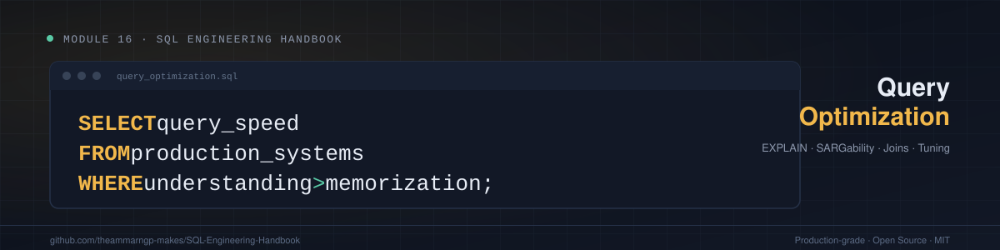
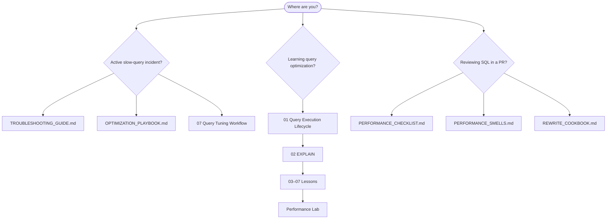
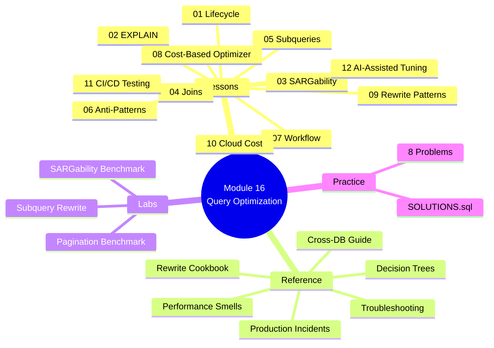

# Module 16 — Query Optimization



[](LICENSE)
[]()
[]()

Welcome to **Module 16 — Query Optimization** of the [SQL Engineering Handbook](https://github.com/theammarngp-makes/SQL-Engineering-Handbook). This module is a production-grade engineering reference for database engineers, analytics engineers, backend engineers, and senior data analysts who need to reason about *why* queries are slow — not just how to write correct SQL.

> **Quick links:** [Start Learning](#quick-start-paths) · [Lessons](#complete-topic-index) · [Reference Library](#engineering-reference-library) · [Performance Lab](#performance-lab) · [Diagrams](#diagram-gallery) · [Cheatsheet](./CHEATSHEET.md) · [Troubleshooting](./TROUBLESHOOTING_GUIDE.md)

---

## Executive Engineering Overview

Every module before this one taught you how to get a *correct* answer from SQL. This module teaches you how to get a *fast* one — and, more importantly, how to diagnose slowness systematically before touching anything.

Query optimization is where SQL stops being a language you write and becomes a system you reason about. The same `SELECT` can execute in 2 milliseconds or 20 seconds depending on indexes, statistics, join order, and query shape — and the engine, not the syntax, decides which one you get.

This module is designed to sit beside **[PostgreSQL Documentation](https://www.postgresql.org/docs/current/performance-tips.html)**, **[Microsoft Learn](https://learn.microsoft.com/en-us/sql/relational-databases/query-processing-architecture-guide)**, **[Oracle Database Docs](https://docs.oracle.com/en/database/oracle/oracle-database/19/tgsql/sql-processing.html)**, and ***[Use The Index, Luke!](https://use-the-index-luke.com/)*** as a primary engineering reference.

---

## Quick Start Paths

Choose the path that matches your situation:



| Path | Start Here | Then |
|---|---|---|
| **Incident response** | [TROUBLESHOOTING_GUIDE.md](./TROUBLESHOOTING_GUIDE.md) | [OPTIMIZATION_PLAYBOOK.md](./OPTIMIZATION_PLAYBOOK.md) → [DECISION_TREE.md](./DECISION_TREE.md) |
| **Structured learning** | [ENGINEERING_GUIDE.md](./ENGINEERING_GUIDE.md) | [Lesson 01](./01_QUERY_EXECUTION_LIFECYCLE.md) → [07](./07_QUERY_TUNING_WORKFLOW.md) → [Performance Lab](./performance_lab/README.md) |
| **PR / code review** | [PERFORMANCE_CHECKLIST.md](./PERFORMANCE_CHECKLIST.md) | [PERFORMANCE_SMELLS.md](./PERFORMANCE_SMELLS.md) → [REWRITE_COOKBOOK.md](./REWRITE_COOKBOOK.md) |
| **Interview prep** | [CHEATSHEET.md](./CHEATSHEET.md) | [PRODUCTION_INCIDENTS.md](./PRODUCTION_INCIDENTS.md) → [PRACTICE_PROBLEMS.md](./PRACTICE_PROBLEMS.md) |
| **Cross-engine porting** | [CROSS_DATABASE_ENGINEERING.md](./CROSS_DATABASE_ENGINEERING.md) | [ENGINEERING_GLOSSARY.md](./ENGINEERING_GLOSSARY.md) |

---

## Skills Learned

- Trace a query through its full execution lifecycle (Parsing → Binding → Optimization → Execution → Fetch)
- Read `EXPLAIN` / `EXPLAIN ANALYZE` output and distinguish estimated cost from actual cost
- Determine SARGability and rewrite non-SARGable predicates so indexes can be used
- Compare nested loop, hash, and merge join strategies and predict optimizer choices
- Rewrite `IN`, `EXISTS`, and correlated subqueries into the fastest equivalent
- Identify 55+ production performance smells before they ship
- Follow a repeatable, five-step query-tuning workflow

---

## Business Motivation

In production, a slow query is never just a slow query:

| Impact | Example |
|---|---|
| Executive dashboards timing out | Board meeting report fails mid-presentation |
| Payment reconciliation missing SLA | Nightly batch exceeds 4-hour window |
| Fraud detection falling behind | Transaction volume outpaces query throughput |
| Support queues growing | "Find open tickets" scans full table on every page load |

Data analysts who can only *write* correct SQL hit a ceiling. The ones pulled into architecture conversations can explain *why* a query is slow and *how* to fix it — in language a backend engineer or DBA respects.

---

## Industry Usage

| Industry | Where This Module's Techniques Show Up |
|---|---|
| Banking / Finance | Fraud-detection queries keeping pace with transaction volume |
| Healthcare | Compliance reporting under strict runtime windows |
| Retail / E-commerce | Product search and dashboards under peak-traffic load |
| SaaS | Multi-tenant queries where data skew silently degrades plans |
| Insurance | Actuarial aggregation against multi-year historical tables |
| Logistics | Real-time inventory queries where OFFSET pagination is common |
| HR / Workforce | Staffing and compliance reports at company scale |

---

## Learning Roadmap


**Estimated study time**: 10–14 hours including practice problems and performance lab.

**Difficulty**: Advanced — assumes production judgment, not just syntax fluency.

**Prerequisites**: Modules 01–14, particularly [`03_Joins`](../03_Joins), [`04_Subqueries`](../04_Subqueries), [`06_CTEs`](../06_CTEs), [`07_Window_Functions`](../07_Window_Functions).

---

## Complete Topic Index

| # | Topic | Core Question | Guide | SQL Lab |
|---|---|---|---|---|
| 01 | Query Execution Lifecycle | What happens between "Run" and rows returned? | [Guide](./01_QUERY_EXECUTION_LIFECYCLE.md) | [SQL](./01_QUERY_EXECUTION_LIFECYCLE.sql) |
| 02 | EXPLAIN & Execution Plans | How do I ask the engine to show its work? | [Guide](./02_EXPLAIN_AND_EXECUTION_PLANS.md) | [SQL](./02_EXPLAIN_AND_EXECUTION_PLANS.sql) |
| 03 | SARGability & Index Usage | Why does the same filter sometimes use an index and sometimes not? | [Guide](./03_SARGABILITY_AND_INDEX_USAGE.md) | [SQL](./03_SARGABILITY_AND_INDEX_USAGE.sql) |
| 04 | Join Optimization | How does the optimizer decide *how* to join? | [Guide](./04_JOIN_OPTIMIZATION.md) | [SQL](./04_JOIN_OPTIMIZATION.sql) |
| 05 | Subquery & CTE Optimization | When does EXISTS beat IN? When does a CTE hurt? | [Guide](./05_SUBQUERY_AND_CTE_OPTIMIZATION.md) | [SQL](./05_SUBQUERY_AND_CTE_OPTIMIZATION.sql) |
| 06 | Anti-Patterns | What recurring mistakes wreck performance? | [Guide](./06_COMMON_PERFORMANCE_ANTI_PATTERNS.md) | [SQL](./06_COMMON_PERFORMANCE_ANTI_PATTERNS.sql) |
| 07 | Query Tuning Workflow | How do I tune systematically instead of guessing? | [Guide](./07_QUERY_TUNING_WORKFLOW.md) | — |
| 08 | Cost-Based Optimizer | How does the engine choose a plan, and when does it choose wrong? | [Guide](./08_COST_BASED_OPTIMIZER.md) | [SQL](./08_COST_BASED_OPTIMIZER.sql) |
| 09 | Query Rewrite Patterns | What are the standard, safe rewrite techniques? | [Guide](./09_QUERY_REWRITE_PATTERNS.md) | [SQL](./09_QUERY_REWRITE_PATTERNS.sql) |
| 10 | Cloud Cost Optimization & Resource Governance | Why can a fast query still be an expensive one? | [Guide](./10_CLOUD_COST_OPTIMIZATION_AND_RESOURCE_GOVERNANCE.md) | [SQL](./10_CLOUD_COST_OPTIMIZATION_AND_RESOURCE_GOVERNANCE.sql) |
| 11 | Automated Performance Testing & CI/CD Integration | How do I stop a regression from ever reaching production? | [Guide](./11_AUTOMATED_PERFORMANCE_TESTING_AND_CICD_INTEGRATION.md) | [SQL](./11_AUTOMATED_PERFORMANCE_TESTING_AND_CICD_INTEGRATION.sql) |
| 12 | AI-Assisted Query Tuning Workflow | How do I safely use AI assistance without trusting it blindly? | [Guide](./12_AI_ASSISTED_QUERY_TUNING_WORKFLOW.md) | [SQL](./12_AI_ASSISTED_QUERY_TUNING_WORKFLOW.sql) |

---

## Engineering Reference Library

> **How this differs from the Lessons above:** Lessons 01-12 are the
> primary curriculum -- read them in order. The documents below are a
> curated index into that same material, organized by *when you'd reach
> for it* (an active incident, a PR review, interview prep) rather than
> by topic order. Where a reference doc and a lesson section cover
> overlapping ground, the lesson is the source of truth; the reference
> doc is a fast-lookup index, not a second copy to edit independently.


| Document | Purpose | When to Open |
|---|---|---|
| [ENGINEERING_GUIDE.md](./ENGINEERING_GUIDE.md) | Module architecture and orientation | First visit; onboarding a teammate |
| [TROUBLESHOOTING_GUIDE.md](./TROUBLESHOOTING_GUIDE.md) | Symptom-first diagnostic flowchart | Active slow-query incident |
| [REWRITE_COOKBOOK.md](./REWRITE_COOKBOOK.md) | 15 canonical query rewrites | You know the pattern, need the fix |
| [PERFORMANCE_SMELLS.md](./PERFORMANCE_SMELLS.md) | 55+ code smell catalog | PR review; pre-release audit |
| [PRODUCTION_INCIDENTS.md](./PRODUCTION_INCIDENTS.md) | 8 realistic post-mortems | Learning from real outages |
| [PERFORMANCE_CHECKLIST.md](./PERFORMANCE_CHECKLIST.md) | Pre-merge and pre-deployment checklists | Before shipping SQL to production |
| [OPTIMIZATION_PLAYBOOK.md](./OPTIMIZATION_PLAYBOOK.md) | 6 structured tuning sequences | Recurring scenario (regression, batch SLA) |
| [DECISION_TREE.md](./DECISION_TREE.md) | Visual decision guides | Unsure which fix to try first |
| [CROSS_DATABASE_ENGINEERING.md](./CROSS_DATABASE_ENGINEERING.md) | 8-engine comparison matrix | Porting queries across engines |
| [BENCHMARK_GUIDE.md](./BENCHMARK_GUIDE.md) | Measurement methodology | Validating a rewrite with evidence |
| [CHEATSHEET.md](./CHEATSHEET.md) | One-page quick reference | During tuning; interview cram |
| [ENGINEERING_GLOSSARY.md](./ENGINEERING_GLOSSARY.md) | Term definitions | Unfamiliar optimizer terminology |
| [BEST_PRACTICES.md](./BEST_PRACTICES.md) | Engineering standards | Setting team conventions |
| [COMMON_MISTAKES.md](./COMMON_MISTAKES.md) | 12 frequent mistakes | Avoiding beginner-to-senior traps |
| [REAL_WORLD_CASEBOOK.md](./REAL_WORLD_CASEBOOK.md) | 6 end-to-end case studies | Connecting business context to fixes |
| [PRODUCTION_NOTES.md](./PRODUCTION_NOTES.md) | Operational deployment guidance | Deploying indexes and rewrites safely |
| [INTERVIEW_GUIDE.md](./INTERVIEW_GUIDE.md) | Senior/Principal interview questions and model answers | Interview prep, either side of the table |
| [OPTIMIZER_MYTHS.md](./OPTIMIZER_MYTHS.md) | Common optimizer misconceptions, corrected | Debunking "common knowledge" that's actually wrong |
| [COST_SMELLS.md](./COST_SMELLS.md) | Cost-focused companion to PERFORMANCE_SMELLS.md | Cloud spend review (Lesson 10) |
| [PROMPT_TEMPLATES.md](./PROMPT_TEMPLATES.md) | 5 copy-paste prompts for safe AI-assisted tuning | Before accepting an AI-suggested fix (Lesson 12) |

---

## Performance Lab

Hands-on benchmark exercises with baseline queries and progressive optimizations:

| Lab | Topic | File |
|---|---|---|
| SARGability | Function on column → range rewrite → covering index | [README](./performance_lab/README.md) |
| Pagination | OFFSET vs. keyset at scale | [SQL](./performance_lab/pagination_benchmark.sql) |
| Subquery Rewrite | Correlated subquery → window function | [SQL](./performance_lab/subquery_rewrite_benchmark.sql) |

---

## Practice & Solutions

- [PRACTICE_PROBLEMS.md](./PRACTICE_PROBLEMS.md) — 8 multi-level problems
- [SOLUTIONS.sql](./SOLUTIONS.sql) — executable solutions with engineering commentary

---

## Diagram Gallery

| Diagram | Used In |
|---|---|
| [`sql-execution-pipeline.svg`](./assets/diagrams/sql-execution-pipeline.svg) | Lesson 01 |
| [`execution-plan-tree.svg`](./assets/diagrams/execution-plan-tree.svg) | Lesson 02 |
| [`sargable-vs-non-sargable.svg`](./assets/diagrams/sargable-vs-non-sargable.svg) | Lesson 03 |
| [`covering-index.svg`](./assets/diagrams/covering-index.svg) | Lesson 03 |
| [`nested-loop-vs-hash-vs-merge.svg`](./assets/diagrams/nested-loop-vs-hash-vs-merge.svg) | Lesson 04 |
| [`predicate-pushdown.svg`](./assets/diagrams/predicate-pushdown.svg) | Lesson 04 |
| [`query-tuning-workflow.svg`](./assets/diagrams/query-tuning-workflow.svg) | Lesson 07 |
| [`optimization-checklist.svg`](./assets/diagrams/optimization-checklist.svg) | Reference |
| [`explain-to-cost-mapping.svg`](./assets/diagrams/explain-to-cost-mapping.svg) | Lesson 10 |
| [`automate-vs-manual-decision-tree.svg`](./assets/diagrams/automate-vs-manual-decision-tree.svg) | Lesson 11 |
| [`ai-tuning-validation-workflow.svg`](./assets/diagrams/ai-tuning-validation-workflow.svg) | Lesson 12 |

See [`assets/DIAGRAM_SPEC.md`](./assets/DIAGRAM_SPEC.md) for design specifications.

---

## Architecture Overview

```text
┌──────────────────────────────────────────────────────────────┐
│  Layer 1: Lessons (01–07)                                     │
│  Conceptual teaching — lifecycle, EXPLAIN, SARGability,       │
│  joins, subqueries, anti-patterns, workflow                   │
├──────────────────────────────────────────────────────────────┤
│  Layer 2: Engineering Documents                             │
│  Reference library — cookbooks, smells, incidents,            │
│  checklists, playbooks, decision trees, cross-DB guide        │
├──────────────────────────────────────────────────────────────┤
│  Layer 3: Labs & Practice                                     │
│  performance_lab/, PRACTICE_PROBLEMS.md, SOLUTIONS.sql         │
└──────────────────────────────────────────────────────────────┘
```

---

## Module Structure

```text
16_QUERY_OPTIMIZATION/
├── README.md                          ← You are here
├── ENGINEERING_GUIDE.md               ← Start here for orientation
├── 01–07 Lessons (.md + .sql)       ← Core teaching content
├── Engineering Documents (16 files)  ← Reference library
├── performance_lab/                  ← Hands-on benchmarks
├── PRACTICE_PROBLEMS.md
├── SOLUTIONS.sql
├── CONTRIBUTING.md
├── CONTRIBUTOR_ENGINEERING_NOTES.md
└── assets/
    ├── DIAGRAM_SPEC.md
    ├── images/hero.svg
    └── diagrams/ (8 SVGs)
```

---

## Learning Checklist

- [ ] Can explain the query execution lifecycle without notes
- [ ] Can read `EXPLAIN ANALYZE` and identify the most expensive step
- [ ] Can identify a non-SARGable predicate on sight and rewrite it
- [ ] Can predict nested loop vs. hash join behavior for a given scenario
- [ ] Can rewrite a correlated subquery as a JOIN or window function
- [ ] Can name at least 10 production anti-patterns from memory
- [ ] Completed all 8 practice problems
- [ ] Completed at least one performance lab benchmark
- [ ] Read at least 3 production incident case studies

---

## Production Checklist


- [ ] Slow query logging enabled with appropriate threshold
- [ ] `pg_stat_statements` / Query Store capturing top queries
- [ ] Statistics refresh scheduled after bulk operations
- [ ] Index usage audited — unused indexes identified for removal
- [ ] No `NOT IN` against nullable columns in production SQL
- [ ] Keyset pagination implemented for all user-facing paginated endpoints
- [ ] Statement timeout configured to prevent runaway queries

---

## Dialect Coverage

Examples are ANSI-standard SQL first, with per-engine notes in each lesson covering **PostgreSQL, MySQL, SQL Server, Oracle, SQLite, and DuckDB**. See [CROSS_DATABASE_ENGINEERING.md](./CROSS_DATABASE_ENGINEERING.md) for the full comparison matrix including **Snowflake** and **BigQuery**.

---

## Related Modules

[`03_Joins`](../03_Joins) · [`04_Subqueries`](../04_Subqueries) · [`06_CTEs`](../06_CTEs) · [`07_Window_Functions`](../07_Window_Functions) · [`14_VIEWS`](../14_VIEWS)

**Previous module**: [`14_VIEWS`](../14_VIEWS)

---

## Further Reading

- [Use The Index, Luke!](https://use-the-index-luke.com/) — SARGability, indexing, pagination
- [PostgreSQL: Using EXPLAIN](https://www.postgresql.org/docs/current/using-explain.html)
- [Microsoft Learn: Query Processing Architecture](https://learn.microsoft.com/en-us/sql/relational-databases/query-processing-architecture-guide)
- [MySQL: Optimizing Queries with EXPLAIN](https://dev.mysql.com/doc/refman/8.0/en/explain.html)

---

## Contributor Guide

See [CONTRIBUTING.md](./CONTRIBUTING.md) for naming conventions, documentation structure, and review checklist. Extended guidance in [CONTRIBUTOR_ENGINEERING_NOTES.md](./CONTRIBUTOR_ENGINEERING_NOTES.md).

---

## Document Map



---

## Version Compatibility

| Engine | Minimum Version |
|---|---|
| PostgreSQL | 12+ |
| MySQL | 8.0.18+ |
| SQL Server | 2017+ |
| Oracle | 19c+ |
| SQLite | 3.35+ |
| DuckDB | 0.9+ |

---

*Part of the [SQL Engineering Handbook](https://github.com/theammarngp-makes/SQL-Engineering-Handbook) · Module 16 · MIT License*
