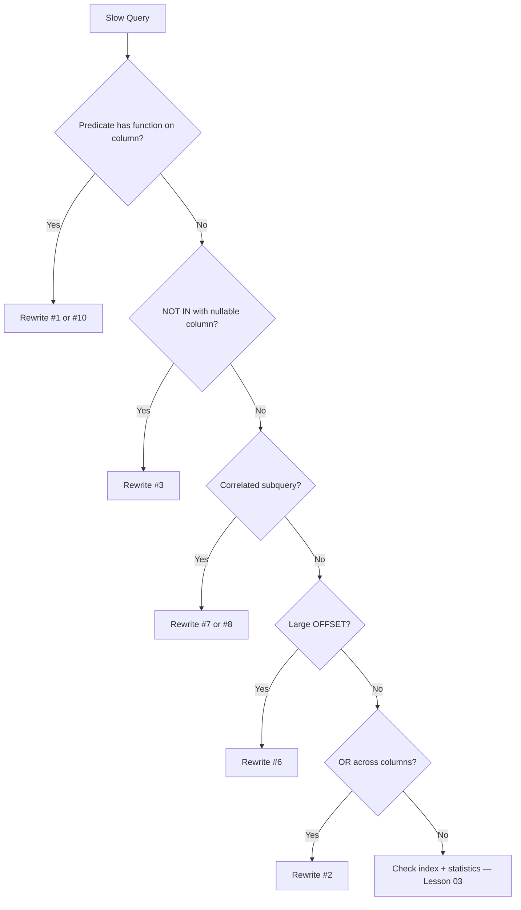

# Query Rewrite Cookbook

> **Module 16 · Query Optimization · Reference Library**
> [Home](./README.md) · [Smells](./PERFORMANCE_SMELLS.md) · [Decision Trees](./DECISION_TREE.md) · [Lessons 03–06](./README.md#complete-topic-index)

A catalog of canonical SQL rewrites that preserve logical correctness while unlocking faster physical execution plans. Each entry follows the same structure: **Problem → Rewrite → Reason → Tradeoffs**.

For runnable before/after SQL, see the matching `.sql` files in each lesson.

---

## Rewrite Index

| # | Pattern | From | To | Lesson |
|---|---|---|---|---|
| 1 | Function on column | `WHERE YEAR(col) = 2023` | Range predicate | 03 |
| 2 | OR across columns | `WHERE a = 1 OR b = 2` | `UNION ALL` | 06 |
| 3 | NOT IN (nullable) | `NOT IN (SELECT ...)` | `NOT EXISTS` | 05 |
| 4 | DISTINCT masking join | `SELECT DISTINCT ... JOIN` | `EXISTS` or fix join | 06 |
| 5 | SELECT * | `SELECT *` | Explicit column list | 06 |
| 6 | OFFSET pagination | `LIMIT n OFFSET m` | Keyset pagination | 06 |
| 7 | Correlated subquery (rank) | `(SELECT COUNT(*) ... WHERE correlated)` | Window function | 05 |
| 8 | Correlated subquery (aggregate) | `(SELECT MAX(...) WHERE correlated)` | `MAX() OVER (PARTITION BY ...)` | 05 |
| 9 | IN (existence check) | `WHERE col IN (SELECT ...)` | `WHERE EXISTS (...)` | 05 |
| 10 | Scalar function in WHERE | `WHERE UPPER(col) = 'X'` | Bare column + collation or functional index | 03 |
| 11 | Implicit conversion | `WHERE int_col = '4'` | `WHERE int_col = 4` | 03 |
| 12 | Comma join | `FROM a, b WHERE filter` | `FROM a JOIN b ON ... WHERE filter` | 06 |
| 13 | Subquery in FROM (filterable) | Derived table with outer WHERE | Push filter into subquery | 04 |
| 14 | Nested views | `SELECT ... FROM view_of_view` | Flatten to base tables | 06 |
| 15 | ORDER BY RANDOM() | `ORDER BY RANDOM()` | Pre-computed random column or application shuffle | 06 |

---

## 1. Function on Column → Range Predicate

### Problem
```sql
SELECT emp_name FROM employes WHERE YEAR(hire_date) = 2023;
```

### Rewrite
```sql
SELECT emp_name FROM employes
WHERE hire_date >= '2023-01-01' AND hire_date < '2024-01-01';
```

### Reason
`YEAR(hire_date)` wraps the indexed column, making the predicate non-SARGable. The engine must evaluate the function on every row before comparing.

### Tradeoffs
- Range rewrite requires knowing the exact boundary values
- If the function form is required by the application, create a functional index instead (PostgreSQL: `CREATE INDEX ON employes (EXTRACT(YEAR FROM hire_date))`)

### Benchmark Expectation
On 5M rows with index on `hire_date`: Seq Scan (~800ms) → Index Range Scan (~12ms).

---

## 2. OR Across Unrelated Columns → UNION ALL

### Problem
```sql
SELECT emp_name FROM employes
WHERE dept_id = 4 OR hire_date > '2023-01-01';
```

### Rewrite
```sql
SELECT emp_name FROM employes WHERE dept_id = 4
UNION ALL
SELECT emp_name FROM employes
WHERE hire_date > '2023-01-01' AND dept_id <> 4;
```

### Reason
A single B-tree index cannot efficiently serve an OR across two unrelated columns. Splitting lets each branch use its own index.

### Tradeoffs
- `UNION ALL` (not `UNION`) avoids dedup cost if branches are mutually exclusive
- Slightly more verbose SQL; optimizer may still merge plans on some engines

---

## 3. NOT IN → NOT EXISTS

### Problem
```sql
SELECT emp_name FROM employes
WHERE emp_id NOT IN (SELECT manager_id FROM employes);
```

### Rewrite
```sql
SELECT e.emp_name FROM employes e
WHERE NOT EXISTS (
    SELECT 1 FROM employes m WHERE m.manager_id = e.emp_id
);
```

### Reason
If `manager_id` contains any NULL, `NOT IN` returns zero rows due to three-valued logic. `NOT EXISTS` is NULL-safe and typically compiles to an anti-join.

### Tradeoffs
- None for correctness — always prefer `NOT EXISTS`
- Performance is equivalent or better on modern optimizers

---

## 4. DISTINCT Masking Join Fan-Out → EXISTS

### Problem
```sql
SELECT DISTINCT d.dept_name
FROM departments d JOIN employes e ON e.dept_id = d.dept_id;
```

### Rewrite
```sql
SELECT d.dept_name FROM departments d
WHERE EXISTS (SELECT 1 FROM employes e WHERE e.dept_id = d.dept_id);
```

### Reason
The JOIN produces one row per employee per department, then DISTINCT deduplicates. EXISTS never produces duplicates — no sort/hash-dedup step needed.

### Tradeoffs
- If you need columns from both tables in the result, fix the join cardinality instead (aggregate first, then join)

---

## 5. SELECT * → Explicit Projection

### Problem
```sql
SELECT * FROM employes WHERE dept_id = 4;
```

### Rewrite
```sql
SELECT emp_id, emp_name, hire_date FROM employes WHERE dept_id = 4;
```

### Reason
Pulls unnecessary columns across the network, prevents covering index usage, and breaks silently when schema changes.

### Tradeoffs
- Must update column list when requirements change — this is a feature, not a bug

---

## 6. OFFSET Pagination → Keyset Pagination

### Problem
```sql
SELECT emp_id, emp_name FROM employes
ORDER BY emp_id LIMIT 20 OFFSET 100000;
```

### Rewrite
```sql
SELECT emp_id, emp_name FROM employes
WHERE emp_id > 100000
ORDER BY emp_id LIMIT 20;
```

### Reason
OFFSET forces the engine to generate and discard all skipped rows. Cost grows linearly with page number.

### Tradeoffs
- Cannot jump to arbitrary page number without knowing the cursor value
- Requires stable, indexed sort column

---

## 7. Correlated Subquery (Rank) → Window Function

### Problem
```sql
SELECT e.emp_name,
    (SELECT COUNT(*) FROM employes e2
     WHERE e2.dept_id = e.dept_id AND e2.hire_date <= e.hire_date) AS hire_rank
FROM employes e;
```

### Rewrite
```sql
SELECT e.emp_name,
    RANK() OVER (PARTITION BY e.dept_id ORDER BY e.hire_date) AS hire_rank
FROM employes e;
```

### Reason
Correlated subquery re-evaluates per outer row. Window function computes rank in a single pass.

### Tradeoffs
- Window functions require understanding of `PARTITION BY` / `ORDER BY` semantics
- Some engines optimize correlated subqueries to equivalent window plans — verify with EXPLAIN

---

## 8. Correlated Subquery (Aggregate) → Window Aggregate

### Problem
```sql
SELECT e.emp_name, e.dept_id,
    (SELECT MAX(e2.hire_date) FROM employes e2 WHERE e2.dept_id = e.dept_id) AS latest_hire
FROM employes e;
```

### Rewrite
```sql
SELECT e.emp_name, e.dept_id,
    MAX(e.hire_date) OVER (PARTITION BY e.dept_id) AS latest_hire
FROM employes e;
```

### Reason
Same as #7 — single-pass computation vs. per-row re-execution.

---

## 9. IN (Existence) → EXISTS

### Problem
```sql
SELECT dept_name FROM departments d
WHERE d.dept_id IN (
    SELECT dept_id FROM employes WHERE hire_date > CURRENT_DATE - INTERVAL '30 days'
);
```

### Rewrite
```sql
SELECT dept_name FROM departments d
WHERE EXISTS (
    SELECT 1 FROM employes e
    WHERE e.dept_id = d.dept_id
      AND e.hire_date > CURRENT_DATE - INTERVAL '30 days'
);
```

### Reason
EXISTS short-circuits on first match. IN materializes the full subquery result set. Modern optimizers often rewrite IN to semi-join, but EXISTS is the safer, clearer default.

### Tradeoffs
- On PostgreSQL 12+ / MySQL 8+, performance is often identical — verify with EXPLAIN

---

## 10. Scalar Function in WHERE → Bare Column

### Problem
```sql
SELECT emp_name FROM employes WHERE UPPER(emp_name) = 'AMMAR';
```

### Rewrite (Option A — case-insensitive collation)
```sql
SELECT emp_name FROM employes WHERE emp_name = 'Ammar';
-- with CI collation on emp_name column
```

### Rewrite (Option B — functional index)
```sql
-- CREATE INDEX idx_employes_upper_name ON employes (UPPER(emp_name));
SELECT emp_name FROM employes WHERE UPPER(emp_name) = 'AMMAR';
```

### Reason
Function on column defeats standard B-tree index. Either eliminate the function or index the expression.

---

## 11. Implicit Type Conversion → Explicit Type Match

### Problem
```sql
SELECT emp_name FROM employes WHERE dept_id = '4';
```

### Rewrite
```sql
SELECT emp_name FROM employes WHERE dept_id = 4;
```

### Reason
Comparing INT column to string literal can force implicit CAST on every row in some engines.

---

## 12. Comma Join → Explicit JOIN

### Problem
```sql
SELECT e.emp_name, d.dept_name
FROM employes e, departments d
WHERE e.hire_date > '2023-01-01';
-- missing: e.dept_id = d.dept_id
```

### Rewrite
```sql
SELECT e.emp_name, d.dept_name
FROM employes e
JOIN departments d ON e.dept_id = d.dept_id
WHERE e.hire_date > '2023-01-01';
```

### Reason
Missing join condition produces cartesian product — rows(employes) × rows(departments).

---

## 13. Filter Outside Derived Table → Predicate Pushdown

### Problem
```sql
SELECT e.emp_name FROM employes e
JOIN (SELECT dept_id, dept_name FROM departments) d
    ON e.dept_id = d.dept_id
WHERE d.dept_name = 'Engineering';
```

### Rewrite
```sql
SELECT e.emp_name FROM employes e
JOIN (
    SELECT dept_id, dept_name FROM departments WHERE dept_name = 'Engineering'
) d ON e.dept_id = d.dept_id;
```

### Reason
Modern optimizers usually push the filter automatically, but explicit pushdown guarantees it — especially important when the optimizer cannot prove pushdown is safe (aggregates, DISTINCT in subquery).

---

## 14. Nested Views → Flatten to Base Tables

### Problem
```sql
SELECT * FROM v_employee_summary WHERE dept_id = 4;
-- v_employee_summary wraps v_department_stats wraps base tables
```

### Rewrite
Query base tables directly, or rewrite the view definition to eliminate unnecessary nesting layers.

### Reason
Each view layer can block predicate pushdown and prevent the optimizer from seeing the full query shape.

---

## 15. ORDER BY RANDOM() → Pre-Computed or Application Shuffle

### Problem
```sql
SELECT emp_name FROM employes ORDER BY RANDOM() LIMIT 10;
```

### Rewrite (Option A — indexed random column)
```sql
-- Maintain a random_sort_key column, refreshed periodically
SELECT emp_name FROM employes
WHERE random_sort_key > 0.5
ORDER BY random_sort_key LIMIT 10;
```

### Rewrite (Option B — application layer)
Fetch candidate IDs with an indexed query; shuffle in application code.

### Reason
`RANDOM()` forces a full table scan and sort on every call — no index can help.

---

## Decision Flow



---

## Related Documents

- [05 — Subquery & CTE Optimization](./05_SUBQUERY_AND_CTE_OPTIMIZATION.md)
- [06 — Anti-Patterns](./06_COMMON_PERFORMANCE_ANTI_PATTERNS.md)
- [DECISION_TREE.md](./DECISION_TREE.md)
- [performance_lab/](./performance_lab/) — benchmark the rewrites
- [PERFORMANCE_SMELLS.md](./PERFORMANCE_SMELLS.md) — smell → rewrite mapping

[← Back to Module Home](./README.md)
