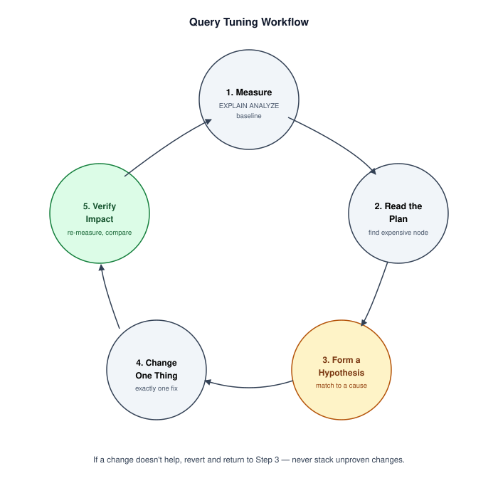
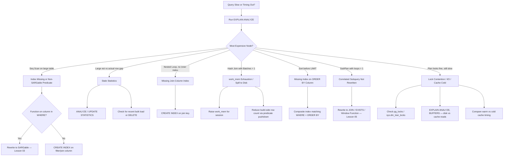

# Troubleshooting Atlas — Query Optimization

> **Module 16 · Query Optimization · Reference Library**
> [Home](./README.md) · [Playbook](./OPTIMIZATION_PLAYBOOK.md) · [Decision Trees](./DECISION_TREE.md) · [Incidents](./PRODUCTION_INCIDENTS.md) · [Lesson 07](./07_QUERY_TUNING_WORKFLOW.md)

This document is the **symptom-first diagnostic tool** for active slow-query incidents and pre-release reviews. For narrative post-mortems of specific outages, see [PRODUCTION_INCIDENTS.md](./PRODUCTION_INCIDENTS.md).



---

## Master Diagnostic Flowchart



---

## Symptom → Cause → Fix Quick Reference

| Symptom | Likely Cause | First Fix | Lesson |
|---|---|---|---|
| Full table scan on filtered column | Non-SARGable predicate | Rewrite bare-column comparison | 03 |
| Full table scan, predicate looks fine | Missing index | `CREATE INDEX` on filter column | 03 |
| Plan changed, no code change | Stale statistics or data growth | `ANALYZE` / `UPDATE STATISTICS` | 01, 02 |
| Fast for some params, slow for others | Parameter sniffing / plan cache | `OPTION (RECOMPILE)` or plan guide | 01 |
| Query fast in dev, slow in prod | Data volume difference | Test against production-scale replica | 07 |
| OFFSET pagination gets slower over time | Engine must skip all prior rows | Keyset pagination | 06 |
| NOT IN returns zero rows unexpectedly | NULL in subquery column | Rewrite to NOT EXISTS | 05 |
| Join produces billions of rows | Missing join condition (cartesian) | Add explicit ON clause | 06 |
| CPU spike, many identical queries | N+1 / RBAR pattern in application | Batch into single set-based query | 06 |
| Hash join suddenly slow | Build side exceeded work_mem | Increase work_mem or filter earlier | 04 |
| Index exists but plan ignores it | Low selectivity or wrong column order | Check composite index leftmost prefix | 03 |
| CTE referenced twice, slow | Unexpected re-execution | Force MATERIALIZED (PG 12+) | 05 |

---

## Step-by-Step Incident Response

### Phase 1: Triage (0–5 minutes)

1. Confirm the query text — is it the same SQL that was fast before?
2. Check `pg_stat_activity` / `sys.dm_exec_requests` for lock waits
3. Note current connection count vs. pool limit
4. Identify whether slowness is intermittent or consistent

### Phase 2: Measure (5–15 minutes)

```sql
-- PostgreSQL
EXPLAIN (ANALYZE, BUFFERS, FORMAT TEXT)
SELECT ... ;

-- MySQL 8.0.18+
EXPLAIN ANALYZE
SELECT ... ;

-- SQL Server
SET STATISTICS IO, TIME ON;
-- then run query and inspect actual execution plan
```

Record: total actual time, most expensive node, estimated vs. actual rows on that node.

### Phase 3: Hypothesize (15–20 minutes)

Match the expensive node against the flowchart above. Write down **one** hypothesis before changing anything.

### Phase 4: Fix (20–60 minutes)

Apply exactly one change. Re-run `EXPLAIN ANALYZE`. Compare against Phase 2 baseline.

### Phase 5: Verify & Document

- Confirm improvement under production-like load
- Check whether the fix regresses other queries (new index slows writes?)
- Document the before/after plan in the incident ticket

---

## Pre-Production Checklists

### Before Merge (PR Review)

- [ ] No `SELECT *` in production queries
- [ ] No functions wrapping indexed columns in WHERE or JOIN predicates
- [ ] No `NOT IN` against nullable subquery columns
- [ ] No large `OFFSET` pagination without keyset alternative documented
- [ ] No implicit cross joins (comma syntax without ON)
- [ ] `EXPLAIN ANALYZE` reviewed for queries touching tables > 100K rows
- [ ] Assumed production data volume stated in PR description

### Before Deployment

- [ ] `ANALYZE` / statistics refresh scheduled post-migration
- [ ] New indexes created with `CONCURRENTLY` (PostgreSQL) or `ONLINE` (SQL Server)
- [ ] `lock_timeout` set for DDL in production
- [ ] Slow query log threshold configured
- [ ] Rollback plan documented (drop index, revert query text)

### Before On-Call Handoff

- [ ] Top 10 slow queries from `pg_stat_statements` reviewed this week
- [ ] Any plan regressions from recent statistics refresh flagged
- [ ] Index bloat check scheduled for high-write tables

---

## Environment Comparison Checklist

When a query is fast in staging and slow in production:

| Check | Staging | Production |
|---|---|---|
| Row count on largest table | ? | ? |
| Statistics last refreshed | ? | ? |
| Index set identical | ? | ? |
| Parameter values representative | ? | ? |
| Buffer cache warm | ? | ? |
| Concurrent query load | ? | ? |

---

## Further Reading

- [OPTIMIZATION_PLAYBOOK.md](./OPTIMIZATION_PLAYBOOK.md) — structured tuning sequences
- [DECISION_TREE.md](./DECISION_TREE.md) — rewrite and index decision trees
- [PRODUCTION_INCIDENTS.md](./PRODUCTION_INCIDENTS.md) — real outage narratives
- [PERFORMANCE_CHECKLIST.md](./PERFORMANCE_CHECKLIST.md) — comprehensive review checklist
- [CHEATSHEET.md](./CHEATSHEET.md) — one-page symptom → fix reference

[← Back to Module Home](./README.md) · [Engineering Guide](./ENGINEERING_GUIDE.md)
